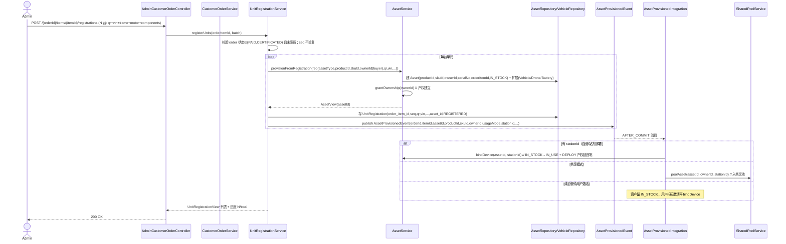

# 增量设计文档：订单 → 资产生成与流转（SKU↔资产，发货前逐台登记）

> **文档性质**：增量设计（相对已落地能力的**新增与变更**），承接 `incremental-design-order-closure.md`（V34 订单闭环）与 `incremental-design-product-device-project.md`（Increment 3）。
> **编写**：高见远（架构师）｜**日期**：2026-08-28｜**状态**：草案，待主理人齐活林汇总
> **技术栈**：Spring Boot 3.3.4 / Java 21 / Spring Data JPA / Flyway / PostgreSQL 16 / Redis / RabbitMQ / Lombok；前端 Vite + React 18 + Ant Design 5。
> **新增迁移**：**V38**（接续磁盘上最新已落地迁移 V37 `project_ledger_master_offset`）。**无新增第三方依赖**。
> **范围锁死**：仅做「订单 → 资产生成与流转（新能源资产闭环）」。**不碰大生态**（物流 / 广告 / 录像 / 附近车辆 / 阈值熄火锁机），相关能力（如 `customer_orders.threshold_config_json`、`vehicle_safety_events`）不在本 increment，留待后续。

---

## 0. 现状调查结论（先读，避免重复造轮子 / 确认硬事实）

### 0.1 已存在、可直接复用的能力（务必复用，不重造）

| 域 / 文件 | 关键可复用点 | 本期缺口 |
| --- | --- | --- |
| `domain/order` V34：`CustomerOrder` / `CustomerOrderItem` + 状态机 + `OrderPaidEvent` / `OrderCompletedEvent` | **订单全生命周期骨架**已落地 | `create()` 当前要求下单即传 `assetId`（单资产直购），与「1 SKU → N 资产」矛盾；`ship()` 不生成资产、无登记守卫 |
| `CustomerOrderItem.java`（1–53） | 字段 `orderId/assetId/skuId/assetType/quantity/unitPrice/subtotal/tenantId/createdAt` | **无逐台标识字段**；`assetId` 在 N 资产模型下应在登记时产生 |
| `domain/asset/Asset.java` | 资产主表**已含** `productId`(:39)、`skuId`(:40)、`manufacturerId`(:38)、`serialNumber`(:41)、`ownerId`(:43)、`qrCode`(:36, unique) | 缺 `orderItemId`（资产→订单溯源）、缺 `componentNosJson`（当前主部件快照） |
| `domain/asset/Vehicle.java` | **已含** `vin` / `frameNo` / `motorNo`（:26-28）—— 即「车架号 / 电机号 / 车架号(主部件)」**已在车辆扩展表** | 无需再在 `vehicles` 加列；登记时把扫描值拷入即可 |
| `domain/asset/Drone.java` | `remoteId`（合规广播码，类比 VIN）、`model` 等 | 无人机无车架/电机号，逐台标识 = `qrCode` + `remoteId` + `serialNumber` |
| `domain/asset/Battery.java` | `model` / `capacityKwh` / `soh` 等 | 电池逐台标识 = `qrCode` + `serialNumber` |
| `AssetService.java` | `createVehicle/createBattery/createDrone`（工厂方法，已建 Asset + 扩展 + 生命周期 PRODUCED + 授予 OWNER 角色/ACL）、`newAsset(...)`、`bindDevice(...)`（IN_STOCK→IN_USE + DEPLOY 产权链首笔 + 补 IoT 设备行）、`autoTransition`（RETIFIED/RECYCLED 闭环终点） | 工厂方法**未携带** `productId/skuId/manufacturerId/serialNumber/orderItemId`；无「从订单登记资产生成资产」的桥接方法；无「主部件更换」方法 |
| `AssetMaintenanceRecord.java` | 维修记录表（assetId/servicedAt/mtype/vendor/cost/note） | 缺「主部件更换留痕」结构化字段（旧/新编号） |
| `AssetStateMachine.java` + `AssetLifecycleEvent.java` | 状态机（IN_STOCK→IN_USE…→RETIRED→RECYCLED/SCRAPPED 终态）+ 生命周期事件溯源 | 资产从订单「建档即进入闭环」可直接复用，无需新状态 |
| `domain/order/event/OrderSharedPoolIntegration`、`OrderSettlementIntegration` | 跨域接线范式：订单域**只经服务接口 / AFTER_COMMIT 领域事件**调他域（遵守 ArchUnit，禁止直持他域 Repository） | 新增「资产生成」事件接线沿用此范式 |
| 前端 `web/src/pages/Orders.jsx` | `SwapPanel` / `RentalPanel` 为**真实订单列表** | 仅作入口，引导至登记面板 |
| 前端 `web/src/pages/OrderManage.jsx` | 目前是 **mock**（deviceCode 输入框 + 合格证表单，标「后端待接入」） | 需替换为真实「发货前逐台登记」面板 |

### 0.2 硬约束（必须遵守，影响所有取舍）

1. **Flyway 全权管 schema、`ddl-auto=none`，禁止运行时动态建表** → 所有新表/加列走 V38 迁移。
2. **ArchUnit**：`common` 不得依赖 `domain`；跨域协作只走**服务接口 / 领域事件**（沿用 `OrderSharedPoolIntegration` 模式，订单域可调 `AssetService` / `SharedPoolService` 这类 `@Service`，但**不得持他域 Repository**）。
3. **金额** `NUMERIC(18,4)`、**时间** `TIMESTAMPTZ`(UTC)。（本 increment 金额字段沿用既有订单项 `unitPrice/subtotal`，已合规；无新增金额列。）
4. **字段扩展走 JSON**（`data_json` / `params_json` / `attr_json` / `*_json`）；结构化、需检索的监管字段才落定列。

### 0.3 关于「旧设计文档 V37 片段」的处置（重要，避免误加列）

`incremental-design-product-device-project.md` 第 246–248 行曾留 `ALTER TABLE customer_orders ADD COLUMN vin/motor_no/frame_no`。**经核实：该片段从未落地**（磁盘最新迁移为 V37 `project_ledger_master_offset`，属另一主题；`CustomerOrder.java` 实体确认**无**这些列）。

本 increment 判定该旧方案**已被取代**，原因：
- 旧方案是「一单 = 一台资产（单资产直购）」思维，把标识挂到订单行；现在模型是「1 SKU → N 资产」，标识是**逐台**的，必须落到逐台登记行。
- `vehicles` 表**已含** `vin/frameNo/motorNo`，资产侧无需再加。
- 因此：**不在 `customer_orders` 加 vin/motor_no/frame_no**；逐台标识统一进新表 `customer_order_unit_registrations`，并在生成资产时拷入 `assets` + `vehicles/drones`（按类型）。旧文档 V37 的 `threshold_config_json` + `vehicle_safety_events`（阈值熄火）属大生态，**不在本 increment 范围**。

---

## 1. 实现方案与框架选型

### 1.1 核心难点与应对

| # | 难点 | 方案 | 理由 |
| --- | --- | --- | --- |
| 1 | 「1 SKU → N 资产」：订单项 N 不定，无法在 `customer_order_items` 上加固定标识列 | 新增 `customer_order_unit_registrations`（order_item_id, seq, qr_code, vin, motor_no, frame_no, component_nos_json, asset_id, status）作为**逐台登记台账**；登记时调 `AssetService` 工厂生成对应资产 | N 是变量，必须 1 对多子表；登记行即「资产从哪来」的权威记录 |
| 2 | 发货前逐台录入（二维码 + 车架号 + 电机号 + 主部件编号），齐全才许发货 | `ship()` 增加**业务守卫**：遍历订单每项，已 `REGISTERED` 的登记数 == `quantity` 才放行；否则抛业务异常 | 满足周老板「发货前录入设备唯一二维码、记录车架号电机号主部件编号」 |
| 3 | 「融合产品端、商品端核心事件产生资产」并让资产进入流转闭环 | 登记生成资产时携带 `product_id`（产品）+ `sku_id`（商品）+ `owner_id`（买家）+ 订单溯源；发布 `AssetProvisionedEvent`；资产域监听器 `AssetProvisionedIntegration` 在 AFTER_COMMIT 将其推入运营闭环（有站点→`bindDevice` IN_USE+DEPLOY 产权链；自营→留 IN_STOCK 待用户激活） | 产品/商品上下文随资产出生即绑定；事件解耦，复用既有生命周期/产权链 |
| 4 | 维修识别 + 更换留痕（F7.4 / F16.5） | 登记行 `component_nos_json` 存「当前主部件编号集合」并同步到 `assets.component_nos_json`（快照）；`asset_maintenance_records` 加 `component_type/old_component_no/new_component_no` 记历史；新增 `AssetService.replaceComponent(...)` 更新快照 + 写历史 | 满足「维修识别更换数据绑定完全」，结构化可检索（按电机号/电池号查更换） |
| 5 | 产权建立时机（旧 `pay()` 对单 assetId 建产权，现 N 资产） | **产权在「登记生成资产」时建立**（每台 Asset 的 `ownerId`=买家，并 `grantOwnership`）；`pay()` 不再对未知资产建产权，仅负责冻押金 + 发 `OrderPaidEvent`（携带 `assetIds` 列表，兼容旧单资产订单） | 资产诞生即归属买家（人人经济）；`pay` 在登记前/后均可，互不阻塞 |

### 1.2 架构模式

- **分层**：沿用 `domain / web.v1 / common.dto / common.enums / common.security`。
- **跨域接线**：订单域 → 资产域**只走 `AssetService` 服务接口 + `AssetProvisionedEvent` 领域事件**（遵守 ArchUnit）；资产域监听器 → 如需入共享池，调 `SharedPoolService` 服务接口（同范式）。
- **字段扩展**：逐台主部件编号集合走 `component_nos_json`（JSON）；结构化检索字段（`vin/frame_no/motor_no`）落定列（资产侧 `vehicles` 已含，登记台账也落定列以便监管直查）。

---

## 2. 数据模型（核心决策）

### 2.1 为什么不在 `customer_order_items` 上加标识列

`quantity` 是变量（1 SKU 可买 3 台、10 台）。若在 `customer_order_items` 上加 `vin/motor_no/...` 只能存「一行一份标识」，无法表达 N 台。且一台资产需一套完整标识（qr+vin+frame+motor+多个主部件），强行加 N 组列会爆炸。**正确做法：1 个订单项 → N 个登记行 → N 台资产**，标识与资产 1:1 绑定在登记台账。

### 2.2 实体关系

- `CustomerOrder` (1) —— (0..*) `CustomerOrderItem`（按 sku+qty 下单）
- `CustomerOrderItem` (1) —— (0..*) `UnitRegistration`（每台 1 行，seq=1..qty）
- `UnitRegistration` (1) —— (1) `Asset`（登记即生成 1 台资产，asset_id 不为空）
- `Asset` (1) —— (0..1) `Vehicle` / `Drone` / `Battery`（按 assetType 落扩展）
- `Asset` (1) —— (0..*) `AssetMaintenanceRecord`（含主部件更换留痕）
- `Asset` (1) —— (0..*) `AssetLifecycleEvent`（闭环溯源，含 PRODUCED/IN_USE/MAINTENANCE…）

### 2.3 字段级决策

| 字段 | 落点 | 说明 |
| --- | --- | --- |
| 二维码 `qr_code` | `unit_registrations.qr_code`（unique）+ `assets.qr_code`（unique） | 逐台唯一，生成资产时作为 `Asset.qrCode` |
| `vin` / `frame_no` / `motor_no` | `unit_registrations`（台账）+ `vehicles`（车辆资产） | 仅车辆有；登记时拷入 `vehicles` |
| `serial_number` | `assets.serial_number`（已存在字段） | 出厂序列号，登记时写入资产 |
| `component_nos_json` | `unit_registrations`（登记快照）+ `assets.component_nos_json`（当前快照，V38 新增列） | 主要元件编号集合（电池包/控制器/遥控器/充电机等），见 §2.4 |
| `product_id` / `sku_id` / `manufacturer_id` / `owner_id` / `order_item_id` | `assets`（product/sku/manufacturer/owner 已存在；`order_item_id` V38 新增列） | 资产出生即绑定「产品 + 商品 + 厂家 + 买家 + 订单项」溯源 |
| 状态 `status` | `unit_registrations.status` ∈ {DRAFT, REGISTERED, CONFIRMED} | 默认 REGISTERED；CONFIRMED 为复核后；ship 守卫按 REGISTERED 计数 |

### 2.4 `component_nos_json` 结构（支撑维修识别 / 更换留痕）

```json
[
  { "type": "BATTERY",    "no": "BAT-8F3A-2210" },
  { "type": "CONTROLLER", "no": "CTRL-21B9-7781" },
  { "type": "CHARGER",    "no": "CHG-55E0-3320" },
  { "type": "REMOTE",     "no": "RMT-77D1-3302" }
]
```
- 车辆：`motor` 已在 `motor_no` 定列，`component_nos` 补 电池包 / 控制器 / 充电机 等。
- 无人机：`remoteId` 在 `drones` 定列，`component_nos` 补 电池 / 遥控器 / 摄像头。
- 电池：`component_nos` 补 电芯模组 等。
- **更换留痕**：维修时调 `AssetService.replaceComponent(assetId, type, oldNo, newNo)` → 更新 `assets.component_nos_json` 对应项 + 写 `asset_maintenance_records`（component_type/old_component_no/new_component_no）历史。F7.4 / F16.5「按电机号/电池号查更换」即查 `asset_maintenance_records` 的 old/new 列 + 关联 `assets`。

---

## 3. 迁移脚本（V38，接续磁盘 V37）

> 文件：`backend/src/main/resources/db/migration/V38__order_unit_registration_and_asset_spawn.sql`

```sql
-- ============ 1) 逐台登记台账：1 SKU → N 资产 的权威记录 ============
CREATE TABLE claw.customer_order_unit_registrations (
  id               BIGINT GENERATED ALWAYS AS IDENTITY PRIMARY KEY,
  order_id         BIGINT NOT NULL REFERENCES claw.customer_orders(id),
  order_item_id    BIGINT NOT NULL REFERENCES claw.customer_order_items(id),
  seq              INT    NOT NULL,                 -- 该 SKU 内第几台（1..quantity）
  qr_code          VARCHAR(128) NOT NULL,           -- 逐台唯一二维码
  vin              VARCHAR(64),                     -- 车架号（车辆）
  frame_no         VARCHAR(64),                     -- 车架号(主部件)
  motor_no         VARCHAR(64),                     -- 电机号
  component_nos_json TEXT,                          -- 主要元件编号集合（JSON，见 §2.4）
  asset_id         BIGINT NOT NULL REFERENCES claw.assets(id),
  status           VARCHAR(16) NOT NULL DEFAULT 'REGISTERED', -- DRAFT/REGISTERED/CONFIRMED
  tenant_id        BIGINT NOT NULL DEFAULT 1,
  created_at       TIMESTAMPTZ NOT NULL DEFAULT now(),
  updated_at       TIMESTAMPTZ NOT NULL DEFAULT now(),
  UNIQUE (order_item_id, seq),
  UNIQUE (qr_code),
  UNIQUE (asset_id)
);
CREATE INDEX idx_unitreg_order ON claw.customer_order_unit_registrations(order_id);
CREATE INDEX idx_unitreg_item  ON claw.customer_order_unit_registrations(order_item_id);

-- ============ 2) assets：资产溯源 + 当前主部件快照 ============
ALTER TABLE claw.assets
  ADD COLUMN order_item_id    BIGINT REFERENCES claw.customer_order_items(id),
  ADD COLUMN component_nos_json TEXT;               -- 当前主部件编号快照（变更见 §2.4）
CREATE INDEX idx_asset_order_item ON claw.assets(order_item_id);

-- ============ 3) 维修更换留痕（F7.4 / F16.5）============
ALTER TABLE claw.asset_maintenance_records
  ADD COLUMN component_type    VARCHAR(32),         -- MOTOR/BATTERY/CONTROLLER/REMOTE/CHARGER...
  ADD COLUMN old_component_no  VARCHAR(64),
  ADD COLUMN new_component_no  VARCHAR(64);
```

> **注意**：本 V38 **不**在 `customer_orders` 加 vin/motor_no/frame_no（旧设计文档 V37 片段已被本方案取代，见 §0.3）；`vehicles` 已含 vin/frame_no/motor_no，无需改动。

---

## 4. 后端改动文件清单

### 4.1 新增

| 文件 | 说明 |
| --- | --- |
| `domain/order/UnitRegistration.java` | 逐台登记实体（映射 `customer_order_unit_registrations`） |
| `domain/order/UnitRegistrationRepository.java` | 按 order_id / order_item_id / (item,seq) / asset_id 查询 |
| `domain/order/UnitRegistrationService.java` | 登记编排：校验 → 调 `AssetService.provisionFromRegistration` → 存登记行 → 发 `AssetProvisionedEvent` |
| `domain/order/event/AssetProvisionedEvent.java` | 资产生成领域事件（payload 见 §5.3） |
| `domain/asset/AssetProvisionedIntegration.java` | 资产域 AFTER_COMMIT 监听器：资产入运营闭环（有站点→bindDevice；共享→SharedPoolService） |
| `common/dto/OrderDtos.java`（改） | `CreateCustomerOrderReq` 改为「订单头 + `List<OrderLineReq>`」；新增 `UnitRegistrationReq` / `UnitRegistrationBatchReq` / `UnitRegistrationView` |

### 4.2 变更

| 文件 | 变更 |
| --- | --- |
| `domain/order/CustomerOrderService.java` | ① `create()`：改按 sku+qty 建订单头 + N 个订单项（不再要求 `assetId`）；② `pay()`：冻押金 + 发 `OrderPaidEvent`（携带 `assetIds`），**不再对未知资产建产权**；③ `ship()`：**加登记守卫**（每项 REGISTERED 数 == quantity 才放行）；④ 注入 `UnitRegistrationService` |
| `domain/order/event/OrderPaidEvent.java` | 增加 `List<Long> assetIds`（兼容旧单资产：assetIds 空时用 order.assetId） |
| `domain/order/event/OrderSharedPoolIntegration.java` | 按 `assetIds` 列表迭代入池（兼容旧单资产） |
| `domain/asset/AssetService.java` | 新增 `provisionFromRegistration(ProvisionAssetReq, operatorId)`：建 Asset（带 productId/skuId/manufacturerId/serialNumber/orderItemId/ownerId）+ 按 assetType 建扩展（vehicle/drone/battery，拷 vin/frame/motor/remoteId）+ 生命周期 PRODUCED + `grantOwnership`；新增 `replaceComponent(assetId, type, oldNo, newNo)`（更新 `assets.component_nos_json` + 写维修记录） |
| `common/dto/AssetRequests.java` | 新增 `ProvisionAssetReq`（assetType, assetNo, qrCode, productId, skuId, manufacturerId, serialNumber, ownerId, orderItemId, + 类型标识 vin/frameNo/motorNo/remoteId/model 等） |
| `web/v1/AdminCustomerOrderController.java` | 新增端点：`POST /{id}/items/{itemId}/registrations`（批量登记）、`GET /{id}/registrations`（进度+列表）、`DELETE /{id}/registrations/{regId}`（发货前纠错） |
| `web/src/pages/OrderManage.jsx` | 真实「发货前逐台登记」面板（替换 mock） |
| `web/src/pages/Orders.jsx` | 列表行加「去登记」入口（跳转 OrderManage） |

---

## 5. 关键流程与接口

### 5.1 发货前逐台登记 → 生成资产 → 进入运营闭环（时序）



### 5.2 `ship()` 业务守卫（发货前必须登记齐全）

```
ship(orderId):
  order = load(orderId); 要求 status ∈ {PAID, CERTIFICATED}
  for item in order.items:
      required = item.quantity
      registered = unitRegistrationRepo.countByOrderItemIdAndStatus(item.id, REGISTERED)
      if registered != required:
          throw BizException(40971, "error.order.registration.incomplete",
                             item.skuId, registered, required)   // 未齐不允许发货
  order.status = SHIPPED; order.shippedAt = now()
```

### 5.3 `AssetProvisionedEvent` payload（融合产品端 + 商品端核心事件）

```java
AssetProvisionedEvent(
    Long orderId,
    Long orderItemId,
    Long assetId,
    String assetType,        // VEHICLE / DRONE / BATTERY / ...
    Long productId,          // 产品端：产品模板/品类溯源
    Long skuId,              // 商品端：SKU 溯源
    Long manufacturerId,     // 厂家
    Long ownerId,            // 买家（产权人）
    String usageMode,        // SELF / SHARED（决定监听器是否入池）
    Long stationId,          // 部署站点（可为空）
    String qrCode,
    String vin,              // 车辆
    String frameNo,
    String motorNo,
    String componentNosJson  // 主要元件编号集合
)
```

### 5.4 `create()` 新契约（按 sku+qty 下单，资产在登记时产生）

```
CreateCustomerOrderReq(
    Long buyerUserId,
    Long productId,
    Long stationId,
    List<OrderLineReq> lines    // { skuId, assetType, quantity, unitPrice }
)
// 兼容旧单资产：若仅传 assetId（无 lines），退化为 1 个订单项 + quantity=1（历史行为）
```

---

## 6. 类图（新增 / 变更实体与关系）

```mermaid
classDiagram
    class CustomerOrder { +Long id +String orderNo +Long buyerUserId +Long productId +Long assetId +String assetType +String status }
    class CustomerOrderItem { +Long id +Long orderId +Long skuId +String assetType +Integer quantity +BigDecimal unitPrice }
    class UnitRegistration { +Long id +Long orderId +Long orderItemId +Integer seq +String qrCode +String vin +String frameNo +String motorNo +String componentNosJson +Long assetId +String status }
    class Asset { +Long id +Long productId +Long skuId +Long manufacturerId +Long ownerId +Long orderItemId +String serialNumber +String qrCode +String componentNosJson +String status }
    class Vehicle { +Long assetId +String vin +String frameNo +String motorNo +String model }
    class Drone { +Long assetId +String remoteId +String model }
    class Battery { +Long assetId +String model +BigDecimal capacityKwh }
    class AssetMaintenanceRecord { +Long id +Long assetId +String componentType +String oldComponentNo +String newComponentNo +String mtype }
    class AssetLifecycleEvent { +Long id +Long assetId +String stage }

    class CustomerOrder "1" --> "0..*" CustomerOrderItem : 订单项(sku+qty)
    class CustomerOrderItem "1" --> "0..*" UnitRegistration : 逐台登记(1->N)
    class UnitRegistration "1" --> "1" Asset : 登记即生成资产
    class Asset "1" --> "0..1" Vehicle : 车辆扩展
    class Asset "1" --> "0..1" Drone : 无人机扩展
    class Asset "1" --> "0..1" Battery : 电池扩展
    class Asset "1" --> "0..*" AssetMaintenanceRecord : 维修/更换留痕
    class Asset "1" --> "0..*" AssetLifecycleEvent : 闭环溯源

    class UnitRegistrationService
    class CustomerOrderService
    class AssetService
    class AssetProvisionedEvent
    class AssetProvisionedIntegration

    CustomerOrderService "..>" UnitRegistrationService : 注入/编排(ship守卫)
    UnitRegistrationService "..>" AssetService : provisionFromRegistration(服务接口)
    UnitRegistrationService "..>" AssetProvisionedEvent : publish
    AssetProvisionedIntegration "..>" AssetService : bindDevice/入池(同域/服务接口)
    AssetProvisionedEvent "..>" AssetProvisionedIntegration : AFTER_COMMIT消费
```

---

## 7. 端点契约（新增 / 变更）

| 域 | 方法 + 路径 | 说明 |
| --- | --- | --- |
| 订单(创建) | `POST /api/v1/admin/customer-orders` 带 `lines:[{skuId,assetType,quantity,unitPrice}]` | 按 sku+qty 下单，不再要求 assetId |
| 订单(登记) | `POST /api/v1/admin/customer-orders/{id}/items/{itemId}/registrations` body=`UnitRegistrationBatchReq{units:[{qrCode,vin,frameNo,motorNo,componentNosJson,serialNumber}]}` | 发货前逐台登记，调资产工厂生成 N 台资产 |
| 订单(进度) | `GET /api/v1/admin/customer-orders/{id}/registrations` | 返回各 sku 登记进度 N/total + 已登记资产列表（供前端面板） |
| 订单(纠错) | `DELETE /api/v1/admin/customer-orders/{id}/registrations/{regId}` | 发货前删除错误登记（资产一并回滚/置 RETIRED） |
| 订单(发货) | `POST /api/v1/admin/customer-orders/{id}/ship` | **守卫**：每项 REGISTERED 数 == quantity 才放行 |
| 资产(更换) | `POST /api/v1/assets/{assetId}/components/replace` body=`{componentType,oldComponentNo,newComponentNo,...}` | 主部件更换留痕（F7.4/F16.5） |

---

## 8. 任务清单（有序、含依赖、按实现顺序；每条标验收点）

> 依赖方向：T1（底座）→ T2（资产桥接）→ T3（订单编排）→ T4（跨域接线）→ T5（端点）→ T6（前端）→ T7（验收）。T2/T4 可部分并行，但 T4 依赖 T2 的事件类，T3 依赖 T1+T2。

| # | 任务 | 涉及文件（≥3） | 依赖 | 优先级 | 验收点 |
| --- | --- | --- | --- | --- | --- |
| **T1** | 数据底座：V38 迁移 + 实体/仓库 + DTO | `V38__...sql`、`UnitRegistration.java`、`UnitRegistrationRepository.java`、`OrderDtos.java`（改）、`AssetRequests.java`（改，加 `ProvisionAssetReq`） | — | P0 | Flyway 校验通过；`customer_order_unit_registrations` 建表+3 索引；`assets` 加 `order_item_id`/`component_nos_json`；`asset_maintenance_records` 加 3 列；DTO 编译通过 |
| **T2** | 资产域桥接：`provisionFromRegistration` + `replaceComponent` | `AssetService.java`（改）、`Asset.java`（已含字段，仅确认映射）、`AssetMaintenanceRecord.java`（已含新列） | T1 | P0 | 调用后产出 1 台 IN_STOCK 资产（带 productId/skuId/ownerId/orderItemId/serialNo）；车辆资产 `vehicles` 含 vin/frame/motor；`replaceComponent` 更新 `assets.component_nos_json` 并写维修记录 |
| **T3** | 订单域编排：`create` 改 sku+qty、`pay` 去建产权、`ship` 守卫、登记服务 | `CustomerOrderService.java`（改）、`UnitRegistrationService.java`（新）、`OrderPaidEvent.java`（改） | T1,T2 | P0 | 新下单不要求 assetId；`ship` 在登记不齐时抛 40971；登记成功生成资产并写登记行 |
| **T4** | 跨域接线：`AssetProvisionedEvent` + `AssetProvisionedIntegration` 监听器 | `AssetProvisionedEvent.java`（新）、`AssetProvisionedIntegration.java`（新）、`OrderSharedPoolIntegration.java`（改，按 assetIds 迭代） | T2,T3 | P1 | 事件 AFTER_COMMIT 消费；有站点→资产 IN_USE + DEPLOY；SHARED→入池；无 Repository 跨域直持（ArchUnit 通过） |
| **T5** | 控制器端点 | `AdminCustomerOrderController.java`（改） | T3,T4 | P1 | 三个登记端点 + ship 守卫端到端可调；进度查询返回 N/total |
| **T6** | 前端：真实登记面板 | `web/src/pages/OrderManage.jsx`（改）、`web/src/pages/Orders.jsx`（改）、`src/api/order.js`（或既有 api 封装，新增登记调用） | T5 | P1 | OrderManage 接真实后端（替换 mock）；逐台扫码/填表；进度 N/total；齐全才可点发货；Orders 行有「去登记」入口 |
| **T7** | 验收：守卫 + ArchUnit + 维修留痕联调 | 以上全部 + 测试 | T4–T6 | P2 | 未登记齐不可发货；ArchUnit 规则绿；按电机号/电池号可查更换历史；资产可从订单溯源（assets.order_item_id） |

---

## 9. 共享知识（跨文件约定）

1. **金额/时间**：金额 `NUMERIC(18,4)`、时间 `TIMESTAMPTZ`(UTC)；本 increment 无新增金额列，沿用订单项 `unitPrice/subtotal`。
2. **字段扩展**：主部件编号集合走 `component_nos_json`；结构化监管字段（vin/frame_no/motor_no）落定列（`vehicles` 已含，登记台账也落定列）。
3. **产权时机**：资产在「登记生成」时建立产权（`ownerId`=买家 + `grantOwnership`），`pay()` 不再对未知资产建产权。
4. **资产闭环**：登记生成资产 → 默认 `IN_STOCK`；有站点/`bindDevice` 推 `IN_USE` + DEPLOY 产权链首笔；后续经既有状态机走到 RETIRED/RECYCLED（残值）终态，不新造状态。
5. **跨域边界（ArchUnit）**：订单域 ↔ 资产域只经 `AssetService` 服务接口 + `AssetProvisionedEvent`；订单域**不得持** `AssetRepository`/`VehicleRepository` 等他域 Repository。
6. **统一响应**：`ApiResult<T>`；异常 `BizException`（登记不全 = 40971；二维码/资产重复复用既有 `error.asset.no.duplicate`）。
7. **component_nos_json 类型枚举**：`BATTERY / CONTROLLER / CHARGER / REMOTE / MOTOR / CAMERA / CELL`（前端下拉 + 后端校验可选）。

---

## 10. 待明确事项（需周老板 / 主理人拍板；均给推荐默认，不阻塞开发）

| # | 待确认 | 对设计影响 | 推荐默认（先按此开发） |
| --- | --- | --- | --- |
| 1 | **登记放行责任方**：厂家（出厂前扫二维码）还是站方（交付前）？ | 影响 `UnitRegistrationService` 的操作人(operatorId)来源与权限校验 | **厂家后台登记**（资产出厂即带唯一标识）；站方仅做 CONFIRMED 复核。先按厂家登记实现 |
| 2 | **N 台未齐是否允许部分发货**？ | `ship()` 守卫严格度 | **不允许部分发货**（必须每项登记齐=quantity 才放行），满足周老板「发货前录入」原话 |
| 3 | **`component_nos_json` 结构 / 类型枚举**：哪些算「主要元件」？ | 前端表单字段 + 后端校验 | 见 §9.7 枚举（电池/控制器/充电机/遥控器/电机/摄像头/电芯）；先按此，后续可加 |
| 4 | **旧单资产直购订单兼容**：`pay()` 不再建产权，历史已支付未登记订单如何处理？ | `pay()` 双路径 | 历史 `assetId` 非空订单：`pay()` 仍对其建产权（兼容）；新多物品订单走登记建产权 |
| 5 | **资产 `order_item_id` 溯源**是否需要反向查询端点（按订单查资产）？ | 是否加 `GET /assets?orderItemId=` | 暂不加独立端点；`GET /customer-orders/{id}/registrations` 已返回资产列表，够用 |

---

## 11. 风险与待确认

1. **`pay()` 产权时机改动**：把建产权从 `pay` 移到「登记生成资产」，是相对 V34 的行为变更，需回归历史单资产订单（`assetId` 非空路径已在 T7 验收覆盖）。
2. **`OrderPaidEvent` 携带 `assetIds` 列表**：`OrderSharedPoolIntegration` 需改为迭代；若 `assetIds` 空且 `order.assetId` 非空则退回单资产（兼容）。SHARED 模式若登记在 pay 之后，入池时机顺延到 `AssetProvisionedIntegration`（已在 T4 处理）。
3. **二维码唯一性冲突**：`qr_code` 在 `unit_registrations` 与 `assets` 均为 unique；同一二维码重复扫描应判重并提示（复用 `error.asset.no.duplicate` 语义）。
4. **不在本 increment 的大生态**：阈值熄火（`vehicle_safety_events`）、附近车辆、物流、广告、录像——均不在此实现；旧设计文档 V37 的 `threshold_config_json` 列**不添加**，待后续单独 increment。
5. **ArchUnit 回归**：新增 `UnitRegistrationService`→`AssetService` 调用、监听器→`AssetService`/`SharedPoolService` 调用均为服务接口，应通过；CI 加本次新增边界规则校验。

*— 增量设计文档终。类图见 §6 mermaid；时序图见 §5.1 mermaid；SQL 见 §3。配套图另存 `docs/order-asset-spawn-class.mermaid` 与 `docs/order-asset-spawn-sequence.mermaid`。*
