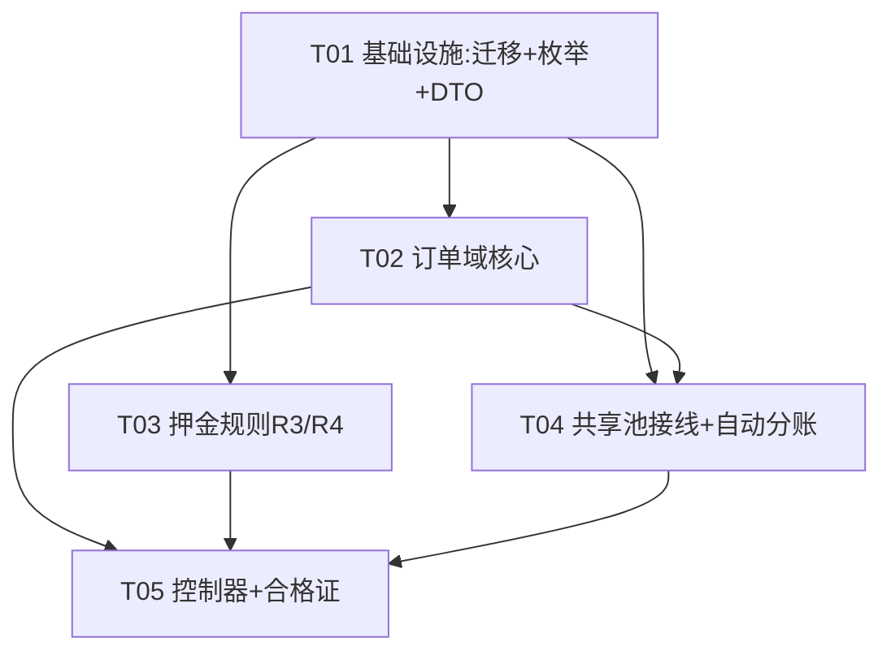

# 增量设计文档：客户订单 / 合格证 / 共享池 / 租金押金 / 自动分成 闭环（Increment 2）

> **文档性质**：增量设计（相对已落地能力的**新增与变更**），配套任务 #34。
> **编写**：高见远（架构师）｜**日期**：2026-08-27｜**状态**：草案，待主理人齐活林汇总
> **技术栈**：沿用现有 —— Spring Boot 3.3.4 / Java 21 / Spring Data JPA / Flyway / PostgreSQL / JJWT / Redis / RabbitMQ。
> **新增迁移**：**V34**（接续 V33）。**无新增第三方依赖**。
> **风格模板**：模仿 `docs/incremental-design-product-link.md`。

---

## 0. 现状调查结论（先读，避免重复造轮子）

### 0.1 `domain/order/` 与 `AdminOrderController` 真实现状
- **`domain/order/` 是空包**：仅含 `package-info.java`（声明“订单域”但无任何实体/仓储/服务/事件）。**不存在 `CustomerOrder` 任何代码**。
- **`AdminOrderController.java`（82 行）只管两类已有订单**：换电订单（`SwapOrder`，只读 + 改状态）与租赁订单（`RentalOrder`，只读）。**完全不涉客户购买订单、合格证、入池、分账**。
- 结论：**Increment 2 是“从零新建客户订单域”，不是“补全”**。下文“复用”仅指 sharedpool / deposit / certificate（设计）等**已存在**的域。

### 0.2 已存在的可复用能力（务必复用，不重造）
| 域 | 关键可复用点 | 缺口（需本期补） |
| --- | --- | --- |
| `domain/sharedpool` | `SharedPoolEntry`/`AssetOwnership`/`RevenueSplitRule`/`RevenueSettlement`/`RentalOrder`；`SharedPoolService.poolAsset(assetId,ownerUserId,stationId,ownerRate,stationRate,dailyUsageFee,perSwapFee)`（已校验 **owner≥50% / station≥15%**，即 R5 下限） | `poolAsset` **不创建** RevenueSplitRule；`completeRental` **不落库** RevenueSettlement（仅算 shares 到 RentalOrder）。需新增 2 个小方法。 |
| `domain/deposit` | `Deposit`(HELD/RETURNED/FORFEITED) + `DepositService.hold/release/forfeit`（复式记账，只动台账不过现金 = **R2 资金不过站**） | 缺 **阶梯押金规则(R4)** 与 **站长押金动态核定(R3)** 的配置/计算。 |
| `common/enums` | `PayStatus`、`RentalType`、`PoolEntryStatus`、`SettlementStatus`、`AssetType`(EV/BATTERY/CHARGER/PV_STATION/DRONE)、`RevenueShareBasis` | 缺 `OrderStatus`、`UsageMode`、`CertificateType`。 |
| `common/api` | `ApiResult.ok` / `BizException.invalidParam|notFound|of` | — |
| 领域事件 | `TelemetryLinkageService`(ApplicationEventPublisher) + `LifecycleLinkageListener`/`RiskLinkageListener`(`@TransactionalEventListener(AFTER_COMMIT)`) 已是项目标准模式 | order 域沿用该模式接线 sharedpool。 |
| 合格证 `Certificate` | **仅存在于 `incremental-design-product-link.md` §3.3 的设计**（`certificates` 表：`cert_type/cert_no/product_link_id/asset_id/data_json/...`）；**代码里尚无 `Certificate` 实体/仓储/服务**，迁移 V27 亦未确认落地。 | 本增量**依赖** product-link 增量的 `certificates` 表；V34 以 ALTER 追加 `order_id`，并调用其出证方法。若该增量未先落地，则本期 T05 一并创建 `Certificate/CertificateRepository/CertificateService`（schema 同 §3.3）。 |

---

## 1. 实现方案与框架选型

### 1.1 核心难点与应对

| 难点 | 方案 | 理由 |
| --- | --- | --- |
| ① 客户订单全生命周期（CREATED→PAID→CERTIFICATED→SHIPPED→COMPLETED） | 新建 `domain/order`：`CustomerOrder` + `CustomerOrderItem` + Service + Repository；状态机用 `OrderStatus` 枚举 + Service 方法守卫（不允许跳变） | 现有 order 包为空，必须新建；状态机集中在 Service 避免散落 |
| ② 支付后 30% 固定押金 + 阶梯(R4) + 资金不过站(R2) | 支付时按 `deposit_rules` 算 **首年 30%**，`DepositService.hold()` 冻结（只动台账） | 复用现有 deposit 双记账；押金≠残值，残值归买家(D41) |
| ③ 支付后自动入池 + 自动建分成规则 | `OrderPaidEvent` → `OrderSharedPoolIntegration`(AFTER_COMMIT) 调 `SharedPoolService.poolAsset` + 新增 `createSplitRule` | 复用 sharedpool；事件解耦，order 域只依赖 Service 接口 |
| ④ 成交自动分账(RevenueSettlement) | `OrderCompletedEvent` → `OrderSettlementIntegration` 调新增 `SharedPoolService.createSettlement(poolEntryId,...)` | 补齐“completeRental 未落 Settlement”的缺口，复用分账口径 |
| ⑤ 合格证复用 | `GET /certificate` 支付后生成/查询 `Certificate`(QUALIFICATION)，绑定 `order_id`+`asset_id` | 沿用 product-link §3.3 schema；`cert_no` 用 `LinkTokenUtil` |

### 1.2 架构模式
- **分层**：沿用 `domain / web.v1 / common.dto / common.enums / common.security`。
- **跨域接线**：order 域 → sharedpool 域 **只通过 `ApplicationEventPublisher` + `SharedPoolService`（服务接口）**，不直接持有他域 Repository（遵守 order 包 `package-info` 的 ArchUnit 边界约束）。
- **资金不过站(R2)**：所有押金/分账只产生 ledger 凭证（`DepositService` 已具备），真实资金直进托管账户，站/平台不触发现金。

### 1.3 关键设计取舍（请主理人知悉）
1. **资产在创建订单时即绑定 `asset_id`**：全款购买 = 买家即时成为资产所有人（残值归买家，D41）。`pay()` 时建 `AssetOwnership`（owner=buyer），再入池（sharedpool 的 `poolAsset` 要求 active ownership）。
2. **分成比例默认值**：用户自设上限内（`ownerRate` 默认 0.70 / `stationRate` 0.15 / 平台 0.10 / 保险 0.05，R5 下限由 `poolAsset` 守卫）。
3. **订单项**：支持一单多资产（`customer_order_items`），但 MVP 允许单资产直购（`asset_id` 也可冗余在 `customer_orders` 便于查询）。

---

## 2. 新增 / 变更实体与文件列表（相对路径，均位于 `backend/src/main/java/com/claw/server/`）

### 2.1 数据模型（实体 + 仓库）

| 实体（新增） | 路径 | 说明 |
| --- | --- | --- |
| `CustomerOrder` | `domain/order/CustomerOrder.java` | 客户购买订单（状态机/使用模式/押金/出证/入池关联） |
| `CustomerOrderItem` | `domain/order/CustomerOrderItem.java` | 订单项（一单多资产） |
| `CustomerOrderRepository` | `domain/order/CustomerOrderRepository.java` | |
| `CustomerOrderItemRepository` | `domain/order/CustomerOrderItemRepository.java` | |
| `DepositRule` | `domain/deposit/DepositRule.java` | 阶梯押金规则(R4)：asset_type + year_index + rate |
| `DepositRuleRepository` | `domain/deposit/DepositRuleRepository.java` | |

| 实体（变更） | 路径 | 变更 |
| --- | --- | --- |
| `certificates`（表，来自 product-link V27） | `db/migration/V34`(ALTER) | 追加 `order_id BIGINT`；若 V27 未落地则 V34 建表 |
| `SharedPoolService` | `domain/sharedpool/SharedPoolService.java` | **扩** 2 方法：`createSplitRule`、`createSettlement` |

### 2.2 服务 / 事件 / DTO

| 文件 | 路径 | 说明 |
| --- | --- | --- |
| `CustomerOrderService` | `domain/order/CustomerOrderService.java` | create/pay/chooseMode/ship/complete + 建 ownership + 押金冻结 + 发事件 |
| `OrderCertificateService` | `domain/order/OrderCertificateService.java` | 支付后出/查 `Certificate`(QUALIFICATION)，复用 `CertificateRepository` |
| `DepositRuleService` | `domain/deposit/DepositRuleService.java` | `computeDepositRate(assetType, yearsInPool)` / `computeDepositAmount(price,...)`（R4） |
| `StationDepositService` | `domain/deposit/StationDepositService.java` | `computeStationDeposit(stationId)`（R3 站长押金动态核定） |
| `OrderPaidEvent` | `domain/order/event/OrderPaidEvent.java` | 支付完成领域事件 |
| `OrderCompletedEvent` | `domain/order/event/OrderCompletedEvent.java` | 订单完成领域事件 |
| `OrderSharedPoolIntegration` | `domain/order/event/OrderSharedPoolIntegration.java` | `@TransactionalEventListener(AFTER_COMMIT)`：SHARED→入池+建分成规则 |
| `OrderSettlementIntegration` | `domain/order/event/OrderSettlementIntegration.java` | `@TransactionalEventListener(AFTER_COMMIT)`：SHARED→建 RevenueSettlement |
| `OrderStatus` | `common/enums/OrderStatus.java` | CREATED/PAID/CERTIFICATED/SHIPPED/COMPLETED/CANCELLED/REFUNDED |
| `UsageMode` | `common/enums/UsageMode.java` | SELF / SHARED |
| `CertificateType` | `common/enums/CertificateType.java` | QUALIFICATION / CONSISTENCY（复用 product-link 口径） |
| `OrderDtos` | `common/dto/OrderDtos.java` | 请求 + 视图（CreateCustomerOrderReq / PayReq / ChooseModeReq / CustomerOrderView / CustomerOrderItemView） |

### 2.3 控制器 / 安全

| 文件 | 路径 | 说明 |
| --- | --- | --- |
| `AdminCustomerOrderController`（新） | `web/v1/AdminCustomerOrderController.java` | 后台客户订单闭环端点（见 §4 契约） |
| `SecurityConfig.java`（扩） | `common/security/SecurityConfig.java` | 后台 `/api/v1/admin/customer-orders/**` 已需 admin 角色，通常已放行；仅确认不遗漏 |

### 2.4 迁移

| 文件 | 路径 | 说明 |
| --- | --- | --- |
| **V34** | `src/main/resources/db/migration/V34__customer_order_closure.sql` | `customer_orders` / `customer_order_items` / `deposit_rules`(+种子) / `certificates`(+order_id) |

---

## 3. 数据结构与接口（表结构要点 + 类图）

### 3.1 迁移 V34（接续 V33，不碰 V1–V33）

```sql
-- V34：客户订单闭环
CREATE TABLE claw.customer_orders (
  id             BIGINT GENERATED ALWAYS AS IDENTITY PRIMARY KEY,
  order_no       VARCHAR(40)  NOT NULL UNIQUE,
  buyer_user_id  BIGINT       NOT NULL,
  product_id     BIGINT,
  asset_id       BIGINT       REFERENCES claw.assets(id),     -- 创建订单即绑定(全款购买)
  asset_type     VARCHAR(16),
  usage_mode     VARCHAR(12)  NOT NULL DEFAULT 'SELF',         -- SELF / SHARED
  status         VARCHAR(16)  NOT NULL DEFAULT 'CREATED',      -- OrderStatus
  total_amount   NUMERIC(18,4) NOT NULL DEFAULT 0,
  deposit_amount NUMERIC(18,4) NOT NULL DEFAULT 0,             -- = total × 首年率(30%)
  deposit_no     VARCHAR(40),                                  -- DepositService.hold 回写
  pay_order_no   VARCHAR(40),
  station_id     BIGINT,                                       -- SHARED 投放站点
  pool_entry_id  BIGINT,
  split_rule_id  BIGINT,
  certificate_id BIGINT,
  shipped_at     TIMESTAMPTZ,
  completed_at   TIMESTAMPTZ,
  cancel_reason  VARCHAR(255),
  refund_status  VARCHAR(16),
  tenant_id      BIGINT       NOT NULL DEFAULT 1,
  deleted        BOOLEAN      NOT NULL DEFAULT FALSE,
  created_at     TIMESTAMPTZ  NOT NULL DEFAULT now(),
  updated_at     TIMESTAMPTZ  NOT NULL DEFAULT now()
);
CREATE INDEX idx_customer_orders_buyer ON claw.customer_orders(buyer_user_id);

CREATE TABLE claw.customer_order_items (
  id         BIGINT GENERATED ALWAYS AS IDENTITY PRIMARY KEY,
  order_id   BIGINT       NOT NULL REFERENCES claw.customer_orders(id),
  asset_id   BIGINT       REFERENCES claw.assets(id),
  sku_id     BIGINT,
  asset_type VARCHAR(16),
  quantity   INT          NOT NULL DEFAULT 1,
  unit_price NUMERIC(18,4) NOT NULL DEFAULT 0,
  subtotal   NUMERIC(18,4) NOT NULL DEFAULT 0,
  tenant_id  BIGINT       NOT NULL DEFAULT 1,
  created_at TIMESTAMPTZ  NOT NULL DEFAULT now()
);
CREATE INDEX idx_order_items_order ON claw.customer_order_items(order_id);

-- R4 阶梯押金规则（车辆/电池同比例，PRD 4.16）
CREATE TABLE claw.deposit_rules (
  id           BIGINT GENERATED ALWAYS AS IDENTITY PRIMARY KEY,
  asset_type   VARCHAR(16) NOT NULL,     -- EV / BATTERY / ...
  year_index   INT         NOT NULL,     -- 第 N 年(从1)
  deposit_rate NUMERIC(6,4) NOT NULL,    -- 0.30/0.25/0.20/0.15
  min_rate     NUMERIC(6,4) NOT NULL DEFAULT 0.15,
  tenant_id    BIGINT NOT NULL DEFAULT 1,
  created_at   TIMESTAMPTZ NOT NULL DEFAULT now(),
  UNIQUE (asset_type, year_index)
);
INSERT INTO claw.deposit_rules(asset_type, year_index, deposit_rate, min_rate) VALUES
  ('EV',1,0.30,0.15),('EV',2,0.25,0.15),('EV',3,0.20,0.15),('EV',4,0.15,0.15),
  ('BATTERY',1,0.30,0.15),('BATTERY',2,0.25,0.15),('BATTERY',3,0.20,0.15),('BATTERY',4,0.15,0.15);

-- certificates 追加 order_id（product-link V27 已建表则 ALTER；否则本迁移建表，schema 见 incremental-design-product-link §3.3）
ALTER TABLE claw.certificates ADD COLUMN IF NOT EXISTS order_id BIGINT;
```

### 3.2 类图（新增/变更实体与关系）

```mermaid
classDiagram
    class CustomerOrder {
      +Long id
      +String orderNo
      +Long buyerUserId
      +Long assetId
      +String assetType
      +UsageMode usageMode
      +OrderStatus status
      +BigDecimal totalAmount
      +BigDecimal depositAmount
      +String depositNo
      +Long stationId
      +Long poolEntryId
      +Long splitRuleId
      +Long certificateId
    }
    class CustomerOrderItem {
      +Long id
      +Long orderId
      +Long assetId
      +Integer quantity
      +BigDecimal unitPrice
      +BigDecimal subtotal
    }
    class DepositRule {
      +Long id
      +String assetType
      +Integer yearIndex
      +BigDecimal depositRate
    }
    class OrderStatus
    class UsageMode
    class CertificateType
    class SharedPoolService {
      +poolAsset(...) SharedPoolEntry
      +createSplitRule(assetId, poolEntryId, ownerRate, stationRate) RevenueSplitRule
      +createSettlement(poolEntryId, start, end) RevenueSettlement
    }
    class AssetOwnership
    class SharedPoolEntry
    class RevenueSplitRule
    class RevenueSettlement
    class Deposit
    class Certificate

    CustomerOrder "1" --> "0..*" CustomerOrderItem
    CustomerOrder "1" --> "0..1" SharedPoolEntry : poolEntryId
    CustomerOrder "1" --> "0..1" RevenueSplitRule : splitRuleId
    CustomerOrder "1" --> "0..1" Certificate : certificateId
    CustomerOrder "1" --> "0..1" Deposit : depositNo
    CustomerOrder "1" --> "1" AssetOwnership : buyer=owner
    DepositRule ".." CustomerOrder : computeDepositAmount
    SharedPoolService "..>" RevenueSplitRule : createSplitRule
    SharedPoolService "..>" RevenueSettlement : createSettlement
```

---

## 4. 端点契约（AdminCustomerOrderController，命名空间 `/api/v1/admin/customer-orders`）

| 方法 + 路径 | 入参（请求 DTO） | 出参（View） | 状态变更 / 副作用 |
| --- | --- | --- | --- |
| `POST /` | `CreateCustomerOrderReq(buyerUserId, assetId, productId, skuId, assetType, quantity, unitPrice, stationId?)` | `CustomerOrderView` | CREATED；写订单+订单项 |
| `POST /{id}/pay` | `PayReq(payOrderNo, paidAmount)` | `CustomerOrderView` | PAID；建 `AssetOwnership`(owner=buyer) + `DepositService.hold`(押金=总额×首年率) + 发 `OrderPaidEvent` |
| `POST /{id}/choose-mode` | `ChooseModeReq(usageMode, stationId?)` | `CustomerOrderView` | 校验 PAID；SHARED 必带 stationId；写 usageMode/stationId |
| `GET /{id}/items` | — | `List<CustomerOrderItemView>` | 只读 |
| `GET /{id}/certificate` | — | `CertificateView` | 须 PAID+；无则 `OrderCertificateService` 出 QUALIFICATION 证书(order_id+asset_id)并回写 certificateId |
| `POST /{id}/ship` | — | `CustomerOrderView` | 校验 PAID/CERTIFICATED；SHIPPED（写 shippedAt） |
| `POST /{id}/complete` | — | `CustomerOrderView` | 校验 SHIPPED；COMPLETED（写 completedAt）+ 发 `OrderCompletedEvent` |
| `GET /` | `?buyerUserId=&status=` | `List<CustomerOrderView>` | 只读列表 |

> DTO 风格与 `AdminDtos.RevenueSettlementView` 一致（Java record）。`CertificateView` 复用 product-link 增量定义（id, certType, certNo, orderId, assetId, dataJson, issuedAt）。

### 4.1 状态机守卫（CustomerOrderService 内）
CREATED →(pay) PAID →(choose-mode 可选) PAID →(ship) SHIPPED →(complete) COMPLETED；
任意态 →(cancel, 限 CREATED/PAID) CANCELLED；PAID 后 →(refund) REFUNDED。CERTIFICATED 为支付后出证的可选中间标记（GET /certificate 成功即置 CERTIFICATED，不影响主链路）。

### 4.2 自动入池 / 自动分成 接线方式（核心复用点，呼应任务要求）
- **入池 + 建分成规则**：`pay()` 提交事务后，`OrderSharedPoolIntegration`（`@TransactionalEventListener(AFTER_COMMIT)`）收到 `OrderPaidEvent`：若 `usageMode==SHARED` → 调 **已有** `SharedPoolService.poolAsset(assetId, buyerUserId, stationId, ownerRate, stationRate, dailyUsageFee, perSwapFee)` 得 `SharedPoolEntry`；再调 **新增** `SharedPoolService.createSplitRule(assetId, poolEntryId, ownerRate, stationRate)` 得 `RevenueSplitRule`；回写 `order.poolEntryId/splitRuleId`。**order 域不持有 sharedpool Repository**。
- **成交自动分账**：`complete()` 后 `OrderSettlementIntegration` 收 `OrderCompletedEvent`：调 **新增** `SharedPoolService.createSettlement(poolEntryId, periodStart, periodEnd)` → 按该池资产 active `RevenueSplitRule` 计算 owner/station/平台/保险份额，落 `RevenueSettlement`(PENDING)；后续由 `AdminProfitController.settle` 标记 SETTLED（复用既有分账报告）。补齐“completeRental 未落 Settlement”的缺口。
- **押金(R2/R4)**：`pay()` 内 `depositAmount = DepositRuleService.computeDepositAmount(total, assetType, 0)`（首年=30%）；`DepositService.hold(userId, assetId, depositAmount, payOrderNo)` 只动台账（MASTER→DEPOSIT_LOCKED），真实资金不过站。
- **站长押金(R3)**：`StationDepositService.computeStationDeposit(stationId)` = Σ(该站入池资产现值)×因子(默认 0.05)；资产入/出池时重算（本期提供计算，冻结执行可在后续任务接 `DepositService`）。

---

## 5. 调用流程（时序）

```mermaid
sequenceDiagram
    participant A as 后台Admin
    participant C as AdminCustomerOrderController
    participant S as CustomerOrderService
    participant D as DepositService/DepositRuleService
    participant OW as AssetOwnershipRepository
    participant E as OrderPaidEvent
    participant L as OrderSharedPoolIntegration
    participant SP as SharedPoolService
    participant P as OrderCompletedEvent
    participant SL as OrderSettlementIntegration
    participant SE as RevenueSettlement

    A->>C: POST /customer-orders {assetId,buyerUserId,...}
    C->>S: create(req)
    S->>S: 生成 orderNo; 写 customer_orders + items(CREATED)
    S-->>C: CustomerOrderView
    C-->>A: 200

    A->>C: POST /customer-orders/{id}/pay {payOrderNo}
    C->>S: pay(id, req)
    S->>OW: insert AssetOwnership(owner=buyer, price)
    S->>D: hold(deposit=总额×30%)  %% R2 资金不过站(台账)
    S->>E: publish OrderPaidEvent(assetId,buyer,station,mode)
    S->>S: status=PAID
    S-->>C: CustomerOrderView
    C-->>A: 200

    E->>L: @TransactionalEventListener(AFTER_COMMIT)
    alt usageMode == SHARED
        L->>SP: poolAsset(assetId,buyer,station,ownerRate,stationRate,...)
        SP-->>L: SharedPoolEntry
        L->>SP: createSplitRule(assetId,poolEntryId,ownerRate,stationRate)
        SP-->>L: RevenueSplitRule
        L->>S: 回写 poolEntryId/splitRuleId
    end

    A->>C: POST /customer-orders/{id}/ship
    C->>S: ship(id)
    S->>S: status=SHIPPED
    S-->>C: CustomerOrderView

    A->>C: POST /customer-orders/{id}/complete
    C->>S: complete(id)
    S->>P: publish OrderCompletedEvent(poolEntryId)
    S->>S: status=COMPLETED
    S-->>C: CustomerOrderView

    P->>SL: @TransactionalEventListener(AFTER_COMMIT)
    SL->>SP: createSettlement(poolEntryId,start,end)
    SP->>SE: insert RevenueSettlement(PENDING,按splitRule分账)
```

---

## 6. 任务列表（有序、含依赖、按实现顺序）

> 规则：最大 5 个任务、每任务 ≥3 文件、第一个为基础设施。优先级 P0/P1。

| 任务 | 名称 | 源文件（节选） | 依赖 | 优先级 |
| --- | --- | --- | --- | --- |
| **T01** | 基础设施：V34 迁移 + 枚举 + DTO | `db/migration/V34__customer_order_closure.sql`、`common/enums/OrderStatus.java`、`UsageMode.java`、`CertificateType.java`、`common/dto/OrderDtos.java` | — | P0 |
| **T02** | 订单域核心：实体/仓储/服务 | `domain/order/CustomerOrder.java`、`CustomerOrderItem.java`、`CustomerOrderRepository.java`、`CustomerOrderItemRepository.java`、`CustomerOrderService.java` | T01 | P0 |
| **T03** | 押金规则(R4 阶梯 + R3 站长动态) | `domain/deposit/DepositRule.java`、`DepositRuleRepository.java`、`DepositRuleService.java`、`StationDepositService.java` | T01 | P0 |
| **T04** | 共享池接线 + 自动入池/分成（事件） | `domain/order/event/OrderPaidEvent.java`、`OrderCompletedEvent.java`、`OrderSharedPoolIntegration.java`、`OrderSettlementIntegration.java`、`domain/sharedpool/SharedPoolService.java`(扩) | T01, T02 | P0 |
| **T05** | 控制器 + 合格证出证 | `web/v1/AdminCustomerOrderController.java`、`domain/order/OrderCertificateService.java`、`common/security/SecurityConfig.java`(确认) | T02, T03, T04 | P0 |

> 注：`Certificate`/`CertificateRepository`/`CertificateService` 来自 product-link 增量；若其未先落地，T05 一并创建（schema 同 incremental-design-product-link §3.3）。T02 的 `pay()` 调用 T03 的 `DepositRuleService` + 既有 `DepositService`，T04 监听 T02 发的事件——三者落地即接通。



---

## 7. 依赖包列表

**本期无新增第三方依赖。** 全部复用现有栈（Spring Boot 3.3.4 / Java 21 / Spring Data JPA / Flyway / PostgreSQL / JJWT / Redis / RabbitMQ / Lombok）。领域事件用 Spring 自带 `ApplicationEventPublisher` + `@TransactionalEventListener`，不引新件。

---

## 8. 共享知识（跨文件约定）

1. **金额/时间**：金额 `NUMERIC(18,4)`，默认 USD；时间 `TIMESTAMPTZ`(UTC)；订单号 `ORD-{yyyyMMdd}-{RAND8}`。
2. **押金口径(R2/R4)**：押金 = 资产总价 × `deposit_rules.deposit_rate`（首年 30%，逐年 25/20/15%）；`DepositService.hold` 只动台账（MASTER→DEPOSIT_LOCKED），真实资金直进托管（资金不过站）。
3. **分成下限(R5)**：`ownerRate∈[0.50,0.70]`、`stationRate∈[0.15,0.30]`、平台 0.10、保险 0.05；`SharedPoolService.poolAsset` 已守卫下限。
4. **事件接线**：order→sharedpool 仅经 `ApplicationEventPublisher` + `SharedPoolService`（服务接口）；监听类标 `@TransactionalEventListener(AFTER_COMMIT)`，方法本身**不再标** `@Transactional`（项目既有约束，见 `RiskLinkageListener`）。
5. **合格证**：`cert_type=QUALIFICATION`；`cert_no` 用 `LinkTokenUtil.getCertNo()`（`CERT-{Q|C}-{yyyyMM}-{RAND6}`）；`data_json` 存买方/资产/日期（模板演进不改表）。
6. **残值归属(D41)**：资产所有人=买家，`AssetOwnership.ownershipType=FULL_PURCHASE`；押金≠残值。
7. **统一响应**：`ApiResult<T>`；异常 `BizException.invalidParam|notFound|of`。
8. **跨域边界**：order 包禁止直持他域 Repository（ArchUnit 守护）；跨域协作走事件/服务接口。

---

## 9. 待明确事项（最多 5 条，均给推荐默认）

| # | 待确认 | 对设计的影响 | 推荐默认（先按此开发，不阻塞） |
| --- | --- | --- | --- |
| 1 | **`Certificate` 实体/表何时落地**（来自 product-link 增量 V27）？ | T05 出证依赖它；V34 需 `certificates.order_id` | 假设 product-link 增量先落地；否则 T05 一并建 `Certificate/CertificateRepository/CertificateService`（schema 同 §3.3）。**不影响表结构** |
| 2 | **订单创建时 `asset_id` 是否必填**（全款购买即时绑定 vs 发货时实例化）？ | `poolAsset` 要求 assetId；入池时机 | **创建订单即绑定 `asset_id`**（买家即时成为所有人）。最简且贴合 D41 |
| 3 | **R3 站长押金是否本期冻结执行**？还是仅提供计算？ | `StationDepositService` 落地范围 | 本期**只提供 `computeStationDeposit` 计算**，冻结执行（调 `DepositService.hold`）留后续任务；不影响订单主链路 |
| 4 | **自动分账触发粒度**：订单 COMPLETED 即建 Settlement，还是按周期（日/周）汇总 rental 收入？ | `createSettlement` 入参 | COMPLETED 建**首笔** Settlement(对账起点)；后续周期结算复用同方法（待 `completeRental` 累计口径确定）。**不阻塞** |
| 5 | **退款/取消(CANCELLED/REFUNDED)的押金与所有权回滚规则**？ | `pay()` 逆操作 | 默认：CANCELLED→退押金(`DepositService.release`)+所有权置失效；REFUNDED 同。细则留后续任务，本期先留状态位 |

*— 增量设计文档终。配套 `docs/class-diagram.mermaid` / `docs/sequence-diagram.mermaid` 供工程师直接引用。*
