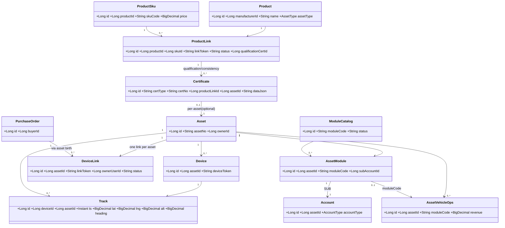
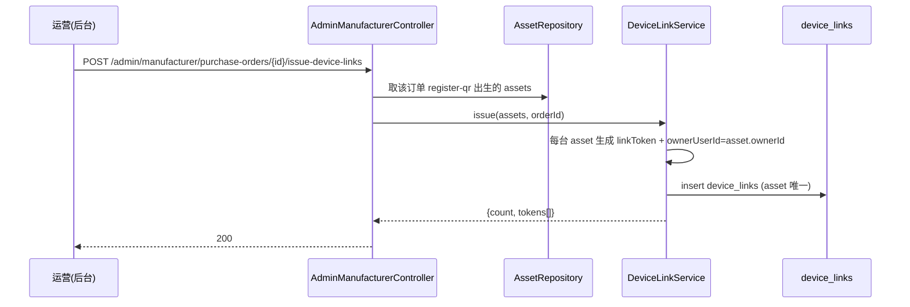
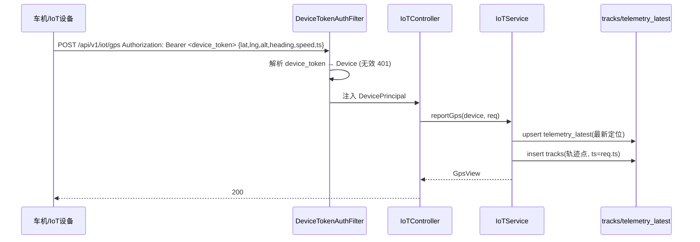
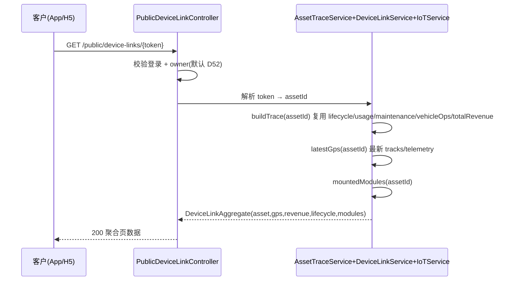
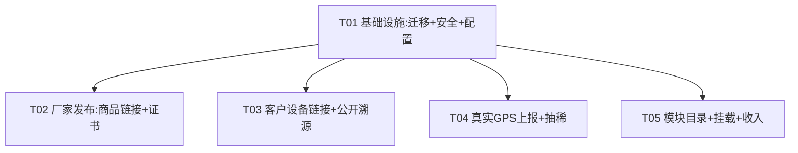

# 增量设计文档：商品链接 / 客户设备链接 / 真实设备 GPS / 功能模块挂载

> **文档性质**：增量设计（仅描述相对 v2.0 已落地能力的**变更与新增**），配套 `docs/incremental-prd-product-link.md`。
> **编写**：高见远（架构师）｜**日期**：2026-08-23｜**状态**：草案，待主理人齐活林汇总
> **技术栈**：沿用现有 —— Spring Boot 3.3.4 / Java 21 / Spring Data JPA / Flyway / PostgreSQL / JJWT / Redis / RabbitMQ。
> **新增迁移**：V26–V29（接续 V25）。**无新增第三方依赖**。

---

## 1. 实现方案与框架选型

### 1.1 核心难点与应对

| 难点 | 方案 | 理由 |
| --- | --- | --- |
| ① 厂家轻量商品卡 + 系统自动出证书 | 新增 `product_links` + `certificates` 两表；证书字段用 **JSON（data_json）** 承载 | 证书字段随"上牌国别/车型"变化大（PRD Q2/Q3），JSON 化使**表结构不受字段清单影响**，模板演进只改代码不改表 |
| ② 客户专属设备链接聚合溯源 | 新增 `device_links`（一台资产一条），公开页复用既有 `asset-trace` 聚合逻辑（抽成 `AssetTraceService`） | 复用 lifecycle/usage/maintenance/vehicle-ops/totalRevenue，不重造溯源 |
| ③ 真实 GPS 上报 + 轨迹抽稀 | **复用既有 `claw.tracks`**（V8 已建），V26 仅追加 `alt`/`heading` 两列；抽稀在**应用层 Java 实现**（距离阈值 + 时间桶降采样） | 不新建平行表、不引 PostGIS/GraphHopper；高并发时序压缩由 TimescaleDB（V8 注释已规划）后续接管 |
| ④ 模块目录 + 按需挂载 + 分模块收入 | 新增 `module_catalog` + `asset_modules`；`module_code` 直接**复用既有 `VehicleOpType` 枚举值**；挂载即开功能子账户（`accounts.account_type=SUB`） | 复用 4.5 功能子账户 + vehicle-ops 收入，扩展 `module_code` 维度区分来源 |
| ⑤ 硬件鉴权 | `devices` 表新增 `device_token`（唯一），上报改 `Authorization: Bearer <device_token>`，新增 `DeviceTokenAuthFilter` | 取代现有"imei 明文入参"；token 不进 URL，避免资产身份泄露 |

### 1.2 架构模式

- **分层**：沿用现有 `domain` / `web.v1` / `common.dto` / `common.security` 分层；新增 `domain.module` 包。
- **聚合复用**：把 `AdminManufacturerController.trace()` 内联的溯源聚合抽成 `AssetTraceService.buildTrace(assetId)`，后台管理员接口与客户公开接口**共用同一聚合**，保证"客户看到的"与"后台溯源"完全一致。
- **报告削峰**：GPS 上报端点保持 REST（与生产 MQTT 等价），`RabbitMQ` 已在 pom 中，后续可将上报转异步（本期同步落库即可，不引新件）。

### 1.3 关键设计取舍（已对 PRD 草案做的小幅修正，请主理人知悉）

1. **IoT 上报端点**：PRD 草案为 `POST /api/v1/iot/assets/{assetToken}/gps`（token 在 URL）。改为 **`POST /api/v1/iot/gps` + `Authorization: Bearer <device_token>`**。理由：凭证不进 URL（防日志/代理泄露资产身份），与现有 `/api/v1/iot/telemetry` 风格一致。
2. **商品链接粒度**：PRD 草案端点挂在 `/products/{productId}` 下，但正文明确"一个链接对应一个 SKU"。设计落地为 **`product_links` 绑定 `sku_id`**（一个 SKU 同时仅一个已发布链接），发布接口接受 `skuId` 参数。
3. **GPS 实体命名**：PRD 称 `asset_gps_point`，但既有 `tracks` 已是"按资产存储的轨迹点表"。为遵守"勿重复建设"，**不新建平行表，直接扩展 `tracks`**。文档中"GPS 点位"即指 `tracks` 行。
4. **证书粒度**：`certificates` 同时持有可空的 `product_link_id` 与 `asset_id`，**默认按 SKU（product_link）出具**，预留逐台（asset）出具能力（Q10 不阻塞）。

---

## 2. 新增 / 变更实体与文件列表（相对路径，均位于 `backend/src/main/java/com/claw/server/`）

### 2.1 数据模型（实体 + 仓库）

| 实体（新增） | 路径 | 说明 |
| --- | --- | --- |
| `ProductLink` | `domain/manufacturer/ProductLink.java` | 轻量商品卡，绑定 sku |
| `ProductLinkRepository` | `domain/manufacturer/ProductLinkRepository.java` | |
| `Certificate` | `domain/manufacturer/Certificate.java` | 合格证(QUALIFICATION)/一致性证明(CONSISTENCY) |
| `CertificateRepository` | `domain/manufacturer/CertificateRepository.java` | |
| `DeviceLink` | `domain/asset/DeviceLink.java` | 客户专属设备链接（按 asset） |
| `DeviceLinkRepository` | `domain/asset/DeviceLinkRepository.java` | |
| `ModuleCatalog` | `domain/module/ModuleCatalog.java` | 模块目录 |
| `ModuleCatalogRepository` | `domain/module/ModuleCatalogRepository.java` | |
| `AssetModule` | `domain/module/AssetModule.java` | 设备-模块挂载关系 |
| `AssetModuleRepository` | `domain/module/AssetModuleRepository.java` | |

| 实体（变更） | 路径 | 变更 |
| --- | --- | --- |
| `Device` | `domain/iot/Device.java` | 新增 `deviceToken`（唯一）字段 |
| `Track` | `domain/iot/Track.java` | 新增 `alt`、`heading` 字段 |
| `AssetVehicleOps` | `domain/asset/AssetVehicleOps.java` | 新增 `moduleCode` 字段 |

### 2.2 服务与 DTO

| 文件 | 路径 | 说明 |
| --- | --- | --- |
| `ProductLinkService` | `domain/manufacturer/ProductLinkService.java` | 发布链接 + 出合格证/一致性证明 |
| `DeviceLinkService` | `domain/asset/DeviceLinkService.java` | 资产出生后发设备链接 |
| `AssetTraceService` | `domain/asset/AssetTraceService.java` | **从 `AdminManufacturerController` 抽取**的溯源聚合（后台/公开共用） |
| `ModuleService` | `domain/module/ModuleService.java` | 模块目录、挂载（开 SUB 户）、分模块收入入账 |
| `DeviceService` | `domain/iot/DeviceService.java` | 设备下发 `device_token`（"硬件下发"的站内等价实现） |
| `TrackSimplifier` | `domain/iot/TrackSimplifier.java` | 轨迹抽稀工具（距离阈值 + 时间桶） |
| `ProductLinkDtos` | `common/dto/ProductLinkDtos.java` | 商品卡/证书 请求与视图 |
| `DeviceLinkDtos` | `common/dto/DeviceLinkDtos.java` | 设备链接/聚合页 视图 |
| `ModuleDtos` | `common/dto/ModuleDtos.java` | 模块目录/挂载 请求与视图 |
| `IoTRequests` | `common/dto/IoTRequests.java` | 扩展 `GpsReport`（lat/lng/alt/heading/speed/ts） |
| `IoTViews` | `common/dto/IoTViews.java` | 扩展 `GpsView` |
| `LinkTokenUtil` | `common/util/LinkTokenUtil.java` | link_token / device_token / cert_no 生成 |

### 2.3 控制器

| 控制器 | 路径 | 命名空间 | 说明 |
| --- | --- | --- | --- |
| `AdminManufacturerController`（扩） | `web/v1/AdminManufacturerController.java` | `/api/v1/admin/manufacturer/*` | 增 `publish-link`、`consistency-cert`、`issue-device-links`；`trace()` 改委托 `AssetTraceService` |
| `PublicProductLinkController`（新） | `web/v1/PublicProductLinkController.java` | `/api/v1/public/*` | 商品卡公开查询 |
| `PublicDeviceLinkController`（新） | `web/v1/PublicDeviceLinkController.java` | `/api/v1/public/*` | 设备溯源聚合 + 实时定位 + 轨迹（按默认需登录+owner） |
| `IoTController`（扩） | `web/v1/IoTController.java` | `/api/v1/iot/*` | 增 `POST /iot/gps` |
| `AssetModuleController`（新） | `web/v1/AssetModuleController.java` | `/api/v1/assets/*` | 模块目录 + 挂载 + 已挂载查询（与现有 `AssetController` 共存） |

### 2.4 安全与配置

| 文件 | 路径 | 变更 |
| --- | --- | --- |
| `SecurityConfig.java` | `common/security/SecurityConfig.java` | `permitAll` 增加 `/api/v1/iot/**`、`/api/v1/public/product-links/**`、`/api/v1/public/device-links/**`、`/api/v1/modules/**` |
| `DeviceTokenAuthFilter.java`（新） | `common/security/DeviceTokenAuthFilter.java` | 解析 `Bearer <device_token>` → `DevicePrincipal` |
| `application.yml` | `src/main/resources/application.yml` | 增加 `claw.iot.gps.report-interval-seconds`（默认 10）、`claw.iot.gps.min-interval-seconds`（默认 1）、抽稀参数 |
| Flyway V26–V29 | `src/main/resources/db/migration/` | 见第 3 节 |

---

## 3. 数据结构与接口（表结构要点）

### 3.1 迁移清单（接续 V25）

- **V26** `iot_extend_tracks_device_token.sql`：`tracks` 加 `alt`/`heading`；`devices` 加 `device_token`（唯一）；补索引。
- **V27** `product_link_and_certificate.sql`：`product_links`、`certificates`。
- **V28** `device_link.sql`：`device_links`。
- **V29** `module_catalog_asset_modules.sql`：`module_catalog`、`asset_modules`；`asset_vehicle_ops` 加 `module_code`；种子模块目录（广告默认禁用）。

### 3.2 `product_links`（轻量商品卡，按 SKU）

```sql
CREATE TABLE product_links (
  id            BIGINT GENERATED ALWAYS AS IDENTITY PRIMARY KEY,
  product_id    BIGINT NOT NULL REFERENCES products(id),
  sku_id        BIGINT NOT NULL REFERENCES product_skus(id),
  link_token    VARCHAR(48) NOT NULL UNIQUE,            -- 公开短链 /p/{token}
  title         VARCHAR(160),
  cover_image_url VARCHAR(320),
  key_specs     TEXT,                                    -- 关键规格(JSON)，默认可取 sku.specs_json
  price         NUMERIC(18,4) NOT NULL DEFAULT 0,
  currency      VARCHAR(8) NOT NULL DEFAULT 'USD',
  status        VARCHAR(16) NOT NULL DEFAULT 'DRAFT',    -- DRAFT/PUBLISHED/ARCHIVED
  qualification_cert_id BIGINT,                          -- 自动生成的合格证
  created_by    BIGINT,
  tenant_id     BIGINT NOT NULL DEFAULT 1,
  created_at    TIMESTAMPTZ NOT NULL DEFAULT now(),
  updated_at    TIMESTAMPTZ NOT NULL DEFAULT now(),
  deleted       BOOLEAN NOT NULL DEFAULT FALSE,
  UNIQUE (sku_id, status)                                -- 一个 SKU 同时仅一个已发布链接
);
```

### 3.3 `certificates`（合格证 / 车辆一致性证明）

```sql
CREATE TABLE certificates (
  id               BIGINT GENERATED ALWAYS AS IDENTITY PRIMARY KEY,
  cert_type        VARCHAR(16) NOT NULL,                 -- QUALIFICATION / CONSISTENCY
  cert_no          VARCHAR(48) NOT NULL UNIQUE,          -- 系统生成 CERT-{TYPE}-{yyyyMM}-{RAND6}
  product_link_id  BIGINT REFERENCES product_links(id),  -- 按 SKU 出具（默认）
  asset_id         BIGINT REFERENCES assets(id),         -- 逐台出具时绑定（可选, Q10）
  data_json        TEXT,                                 -- 证书字段(JSON, 模板驱动; 见 3.3.1)
  template_version VARCHAR(16) DEFAULT 'V1',
  issued_by        BIGINT,
  issued_at        TIMESTAMPTZ NOT NULL DEFAULT now(),
  file_url         VARCHAR(320),                         -- 导出 PDF/图片(上牌用)
  tenant_id        BIGINT NOT NULL DEFAULT 1,
  created_at       TIMESTAMPTZ NOT NULL DEFAULT now(),
  updated_at       TIMESTAMPTZ NOT NULL DEFAULT now()
);
```

**3.3.1 车辆一致性证明（CONSISTENCY）候选字段清单（柬埔寨上牌场景，标注"待用户确认"）**

> 以下字段以 **JSON** 存入 `data_json`，故确认前后**不影响表结构**。仅影响模板与导出排版。

| 分组 | 候选字段（待用户确认是否全量/增删） |
| --- | --- |
| 车辆标识 | `vin`（车辆识别代号/车架号）、`brand`、`model`、`vehicleType`、制造国 `countryOfMfg`、出厂日期 `mfgDate` |
| 质量参数 | `curbWeight`（整备质量）、`grossWeight`（总质量）、`kerbLoad`（载质量） |
| 尺寸/底盘 | `overallDimL/W/H`（长×宽×高）、`wheelbase`（轴距）、`trackFront/Rear`（轮距）、`minGroundClearance` |
| 轮胎 | `tyreSpec`（规格）、`tyreQty` |
| 三电 | `batteryType`、`batteryCapacityKwh`、`batteryVoltage`、`batteryBrand`、`motorModel`、`motorRatedPower`、`motorPeakPower`、`maxSpeed`、`rangeKm`、`chargeType` |
| 座位数 | `seatCount` |
| 厂家信息 | `manufacturerName`、`manufacturerAddr`、`issueDate`、认证标志 `certMark`（如 3C/当地认证） |

- **待用户确认（Q2/Q3）**：① 模板字段是否对齐柬埔寨当地上牌法规（如 MOT 要求）；② 字段由平台统一定义还是各厂家自定义；③ 是否需对接政府备案（GDICT 已降级 Phase3，D50，本期不接）。
- **默认方案**：采用"柬埔寨 EV 上牌通用字段模板 V1"（上表），按 SKU 出具；`cert_no` 系统分配并落库，可在商品卡查看/下载（导出为 PDF/图片由前端/后续任务实现，`file_url` 预留）。

### 3.4 GPS 点位存储与轨迹查询（复用 `tracks`）

```sql
-- V26 在既有 tracks 上追加:
ALTER TABLE tracks ADD COLUMN IF NOT EXISTS alt NUMERIC(9,2);     -- 海拔 m
ALTER TABLE tracks ADD COLUMN IF NOT EXISTS heading NUMERIC(6,2); -- 航向 0-360°
-- 既有索引: idx_tracks_asset_ts (asset_id, ts DESC), idx_tracks_device_ts
```

**写入**：硬件 `POST /api/v1/iot/gps`（Bearer device_token）→ 解析 device → `upsert telemetry_latest`（最新定位）+ `insert tracks`（轨迹点，`ts` 取上报体中的设备时间，便于离线补传去重）。

**实时定位**：`telemetry_latest`（每设备一条）或 `SELECT ... FROM tracks WHERE asset_id=? ORDER BY ts DESC LIMIT 1`。公开页取前者。

**历史轨迹查询（抽稀 + 分页）**：

- 基础查询：`SELECT * FROM tracks WHERE asset_id=? AND ts BETWEEN ? AND ? ORDER BY ts ASC`。
- **抽稀（应用层 `TrackSimplifier`）**，无需新依赖：
  - **时间桶降采样**：跨度 > 1 天按 `bucketSeconds`（默认 60s）抽稀；跨度 <= 1 天按 `maxPoints`（默认 800）均匀抽稀。
  - **距离/转向过滤**：相邻点距离 < `minDistanceMeters`（默认 15m）且航向变化 < `minHeadingDelta`（默认 5°）则丢弃（Douglas-Peucker-lite）。
  - 返回抽稀后点集 + `totalRawPoints`（用于前端显示"已压缩 N%"）。
- **分页**：游标分页 `?from=&to=&limit=500&afterTs=`，避免深翻页。
- **未来增强（非本期）**：TimescaleDB 连续聚合 + PostGIS 空间查询；本期不引入。

### 3.5 `device_links`（客户专属设备链接）

```sql
CREATE TABLE device_links (
  id               BIGINT GENERATED ALWAYS AS IDENTITY PRIMARY KEY,
  asset_id         BIGINT NOT NULL REFERENCES assets(id) UNIQUE, -- 一台设备一个链接
  link_token       VARCHAR(48) NOT NULL UNIQUE,                 -- /d/{token}
  owner_user_id    BIGINT,                                       -- = assets.owner_id（查看权限人）
  purchase_order_id BIGINT REFERENCES purchase_orders(id),
  status           VARCHAR(16) NOT NULL DEFAULT 'ACTIVE',       -- ACTIVE/REVOKED
  expires_at       TIMESTAMPTZ,
  tenant_id        BIGINT NOT NULL DEFAULT 1,
  created_at       TIMESTAMPTZ NOT NULL DEFAULT now(),
  updated_at       TIMESTAMPTZ NOT NULL DEFAULT now()
);
```

- **生成时机（默认 D52/Q7）**：`register-qr` 资产出生后，运营在采购单上点"发设备链接"，为每台资产生成一条 `device_links`（资产出生后逐台生成）。
- **绑定规则**：`device_links.asset_id` 唯一 → 一设备一链接；`owner_user_id` 取自 `assets.owner_id`（= 采购单 `buyer_id`）。
- **token 规则**：`link_token = base62(randomBytes(24))` ≈ 32 字符，URL 安全、不可猜测（防枚举，见第 7 节）。
- **访问模型（默认 D52/Q1）**：需登录且 `AuthContext.userId == owner_user_id`（或具 admin 角色）；匿名→401，非 owner→403。

### 3.6 模块目录与按需挂载

```sql
CREATE TABLE module_catalog (
  id                   BIGINT GENERATED ALWAYS AS IDENTITY PRIMARY KEY,
  module_code          VARCHAR(32) NOT NULL UNIQUE,  -- 复用 VehicleOpType: PASSENGER/LOGISTICS/MOBILE_SELL/RECORDING/ADVERTISING
  name                 VARCHAR(80) NOT NULL,
  description          TEXT,
  applicable_asset_types TEXT NOT NULL DEFAULT '["VEHICLE"]', -- JSON 数组, 按资产类型过滤
  icon_url             VARCHAR(320),
  revenue_account_type VARCHAR(16) NOT NULL DEFAULT 'SUB',     -- 功能子账户(4.5)
  status               VARCHAR(16) NOT NULL DEFAULT 'ENABLED', -- ENABLED/DISABLED(广告默认 DISABLED, D9)
  sort_no              INT DEFAULT 0,
  tenant_id            BIGINT NOT NULL DEFAULT 1,
  created_at           TIMESTAMPTZ NOT NULL DEFAULT now(),
  updated_at           TIMESTAMPTZ NOT NULL DEFAULT now()
);

CREATE TABLE asset_modules (
  id            BIGINT GENERATED ALWAYS AS IDENTITY PRIMARY KEY,
  asset_id      BIGINT NOT NULL REFERENCES assets(id),
  module_code   VARCHAR(32) NOT NULL REFERENCES module_catalog(module_code),
  sub_account_id BIGINT REFERENCES accounts(id),     -- 挂载即开功能子账户
  mounted_by    BIGINT,
  status        VARCHAR(16) NOT NULL DEFAULT 'ACTIVE',
  config_json   TEXT,
  mounted_at    TIMESTAMPTZ NOT NULL DEFAULT now(),
  created_at    TIMESTAMPTZ NOT NULL DEFAULT now(),
  updated_at    TIMESTAMPTZ NOT NULL DEFAULT now(),
  UNIQUE (asset_id, module_code)
);

-- asset_vehicle_ops 扩展 module_code 区分收入来源
ALTER TABLE asset_vehicle_ops ADD COLUMN IF NOT EXISTS module_code VARCHAR(32);
```

- **按需挂载**：`POST /api/v1/assets/{assetId}/modules/{moduleCode}/mount` → 校验 `module_catalog`（enabled + 适用资产类型）→ 建 `asset_modules` + 开 `accounts(account_type=SUB, asset_id, ...)` 子账户 → 返回挂载结果。
- **按需加载（默认 Q5）**：客户设备页 `GET /api/v1/assets/{assetId}/modules` 返回已挂载模块列表；每个模块的数据由前端**懒加载/动态组件**渲染，后端按 `module_code` 分别提供数据（本期：客运/物流/售卖/录像直接读 `asset_vehicle_ops` 中对应 `module_code` 的流水与收入；广告默认禁用）。
- **分模块收入入账（默认 Q6/D55）**：记录运营收入时写 `asset_vehicle_ops(module_code, revenue)`，并贷记该资产该模块的 `SUB` 子账户；历史无 `module_code` 的 ops 仍入 `ASSET` 总账户，不改既有分账逻辑。

### 3.7 类图（新增/变更实体与关系）



---

## 4. 程序调用流程（时序）

### 4.1 ① 厂家发布商品链接 + 出合格证/一致性证明

```mermaid
sequenceDiagram
    participant M as 厂家(后台)
    participant C as AdminManufacturerController
    participant S as ProductLinkService
    participant DB as product_links/certificates
    M->>C: POST /admin/manufacturer/products/{pid}/publish-link {skuId,title,cover,price}
    C->>S: publish(skuId,...)
    S->>S: 生成 linkToken; 生成合格证 cert(QUALIFICATION)+certNo
    S->>DB: insert product_link; insert certificate(qualification)
    S-->>C: ProductLinkView(linkToken, certNo)
    C-->>M: 200
    M->>C: POST .../products/{pid}/consistency-cert {vin,motorNo,...}
    C->>S: issueConsistency(...)
    S->>DB: insert certificate(CONSISTENCY, dataJson)
    S-->>C: certNo
    C-->>M: 200
```

### 4.2 ② 客户购买后发设备链接（资产出生后逐台）



### 4.3 ③ 真实设备上报 GPS



### 4.4 ④ 客户打开设备链接聚合展示



---

## 5. 命名空间与现有接口合并/共存方案（回应约束）

| 命名空间 | 处理 | 理由 |
| --- | --- | --- |
| `/api/v1/admin/manufacturer/*` | **沿用**（不合并）。新增 `publish-link`、`consistency-cert`、`issue-device-links` 落在此 | 该前缀承载"厂家/管理员后台、RBAC 鉴权"语义；新端点本质是后台操作，归属清晰 |
| `/api/v1/iot/*` | **共存**（已有 `/iot/telemetry`）。新增 `/iot/gps` | 硬件信任边界（Bearer device_token），与用户 JWT 体系隔离，必须在 `SecurityConfig` 单独放行 |
| `/api/v1/public/*` | **新增**。`product-links/*`（全公开）、`device-links/*`（公开到达但控制器内校验登录+owner） | C 端匿名可达边界；与 `/admin` 严格分离，便于限流与缓存 |
| `/api/v1/assets/*` | **共存**（已有 `AssetController`）。新增 `AssetModuleController` 提供模块目录/挂载/查询 | 资产专属操作归口同一前缀（与既有 vehicle/battery/acl/status/functions 一致），不另起炉灶 |

**结论**：采用"共存不合并"。原因：(a) 三套新端点的**信任边界不同**（匿名客户 / 硬件设备 / 登录运营），合并会模糊 `SecurityConfig` 白名单与鉴权语义；(b) 现有 `/admin/manufacturer/assets/{id}/trace` **保留不动**，客户公开页通过新建 `AssetTraceService` 复用其聚合逻辑（逻辑复用，路由不混）；(c) 模块挂载属资产操作，落在既有 `/assets/*` 最自然。

---

## 6. 任务列表（有序、含依赖、按实现顺序）

> 规则：最大 5 个任务、每任务 ≥3 文件、第一个为基础设施。优先级 P0/P1。

| 任务 | 名称 | 源文件（节选） | 依赖 | 优先级 |
| --- | --- | --- | --- | --- |
| **T01** | 项目基础设施：DB 迁移 V26–V29 + 安全基线 + 配置 | `db/migration/V26..V29`、`SecurityConfig.java`、`DeviceTokenAuthFilter.java`、`application.yml`、`LinkTokenUtil.java` | — | P0 |
| **T02** | 厂家发布：商品链接 + 证书 | `ProductLink.java`、`Certificate.java`、`ProductLinkService.java`、`ProductLinkDtos.java`、`AdminManufacturerController.java`(扩) | T01 | P0 |
| **T03** | 客户设备链接生成 + 公开溯源聚合页 | `DeviceLink.java`、`DeviceLinkService.java`、`AssetTraceService.java`、`DeviceLinkDtos.java`、`PublicProductLinkController.java`、`PublicDeviceLinkController.java` | T01 | P0 |
| **T04** | 真实设备 GPS 上报 + 轨迹抽稀 | `Device.java`(扩)、`Track.java`(扩)、`IoTService.java`(扩)、`DeviceService.java`、`TrackSimplifier.java`、`IoTRequests.java`/`IoTViews.java`(扩)、`IoTController.java`(扩) | T01 | P0 |
| **T05** | 功能模块目录 + 设备挂载 + 分模块收入 | `ModuleCatalog.java`、`AssetModule.java`、`ModuleService.java`、`ModuleDtos.java`、`AssetModuleController.java`、`AssetVehicleOps.java`(扩) | T01 | P1 |

**依赖图**：T02–T05 均仅依赖 T01（可并行推进，互不阻塞）。`AssetTraceService` 在 T03 从 `AdminManufacturerController` 抽取，T03 完成后后台 `trace()` 改为委托（低风险、输出不变）。



---

## 7. 依赖包列表

**本期无新增第三方依赖。** 全部复用现有栈：

| 现有依赖 | 用途 | 本期用法 |
| --- | --- | --- |
| Spring Boot 3.3.4 / Java 21 | 框架 | 全部 |
| Spring Data JPA / Flyway / PostgreSQL | 持久化与迁移 | V26–V29 迁移；新实体映射 |
| JJWT 0.12.6 | JWT | 登录态（既有）；device_token 仅作随机串校验，不新签 JWT |
| Redis / RabbitMQ | 缓存/削峰 | GPS 上报可后续转异步（本期同步落库即可，不引新件） |
| Lombok | 样板 | 全部实体 |

**不引入**：PostGIS / GraphHopper / 地图 SDK（地图渲染为前端职责；轨迹抽稀用 Java 实现）；轨迹压缩后续由 TimescaleDB（V8 已规划）接管。

---

## 8. 共享知识（跨文件约定）

1. **token 生成（`LinkTokenUtil`）**
   - `link_token`（product_link / device_link）：`base62(randomBytes(24))` ≈ 32 字符，URL 安全。
   - `device_token`：`base62(randomBytes(32))` ≈ 43 字符，唯一，存 `devices.device_token`；仅经 `Bearer` 头下发，等同 API Key（本期明文存储，后续可改 SHA-256 哈希存储）。
   - `cert_no`：`CERT-{Q|C}-{yyyyMM}-{RAND6}`（Q=合格证，C=一致性）。
2. **device_token 鉴权**：`DeviceTokenAuthFilter` 仅匹配 `/api/v1/iot/**`，解析 `Authorization: Bearer <device_token>` → `DevicePrincipal`；无效/缺失 → 401。不进 URL。
3. **公开页 token 防枚举**：token 为 32+ 字符随机串（62^32 不可暴力）；公开端点加**每 IP 限流**（网关/Spring 限速，后续任务落地）；不暴露任何自增 ID。
4. **GPS 上报频率配置**（`application.yml`，`claw.iot.gps.*`）：
   - `report-interval-seconds=10`（默认 ≤10s，满足 PRD §8 性能要求）；
   - `min-interval-seconds=1`（低于则拒绝/告警，防刷）；
   - 离线补传：`ts` 取上报体设备时间，服务端按 `(device_id, ts)` 去重；`telemetry_latest` 取最新一条。
5. **抽稀参数**（`claw.iot.gps.simplify.*`）：`maxPoints=800`、`minDistanceMeters=15`、`minHeadingDelta=5`、`bucketSeconds=60`（跨度>1天启用）。
6. **统一响应**：`ApiResult<T>`（code/data/message）；异常用既有 `BizException`。
7. **时区/金额**：时间一律 `TIMESTAMPTZ`（UTC）；金额 `NUMERIC(18,4)`，默认 USD，双币种展示由前端处理（D5）。
8. **资产 owner 绑定**：`device_links.owner_user_id` 与 `assets.owner_id` 保持一致（生成时拷贝采购单 `buyer_id`）。
9. **鉴权默认（D52）**：`product-links` 全公开；`device-links` 需登录且 `userId == owner_user_id`（或 admin 角色）。该行为以配置开关 `claw.public.device-link.require-login=true` 实现，便于用户拍板后一键切换"仅凭链接 token 即可看"。

---

## 9. 待明确事项 / 阻塞点

### 9.1 四个高优阻塞项（主理人已提交用户拍板）—— 影响与默认假设

| # | 阻塞项 | 对数据模型/接口的影响 | 默认假设（先按此开发，不阻塞） |
| --- | --- | --- | --- |
| 1 | 链接访问权限（Q1/D52） | 接口鉴权分支（公开 vs 登录+owner） | 商品链接公开；设备链接**需登录+owner**。数据模型已含 `owner_user_id`，**不影响表结构**；用配置开关预留"仅凭 token"模式 |
| 2 | GPS 设备鉴权（Q4/D54） | 仅新增 `devices.device_token` 列 + 新过滤器 | **device_token Bearer 鉴权**，上报 ≤10s（可配置）。已在 T01/T04 落地 |
| 3 | 模块范围与"按需加载"形态（Q5） | 无（模块用 code 驱动目录，加载为后端按需返回+前端懒渲染） | 复用 `VehicleOpType` 作模块码（客运/物流/售卖/录像启用，广告默认禁用 D9）；同服务按需返回，**不拆微服务** |
| 4 | 设备链接生成时机与粒度（Q7/Q8/D52） | 已在 `device_links.asset_id UNIQUE` 与 `product_links.sku_id` 体现 | **register-qr 资产出生后逐台生成**设备链接；商品链接按 SKU。**不影响表结构** |

> **结论**：四项高优阻塞均有"不影响表结构"的安全默认，可立即开工；仅第 1 项的最终 UX 开关待用户确认。

### 9.2 全部 10 条"需用户确认"逐条裁定

| 编号 | 问题 | 是否实质性改变数据模型/接口 | 默认方案 | 是否阻塞开发 |
| --- | --- | --- | --- | --- |
| Q1 | 链接访问权限 | 否（仅鉴权分支，已用开关预留） | 商品公开 / 设备需登录+owner | 否 |
| Q2 | 证书合规与上牌主体 | **否**（字段走 JSON，模板演进不改表） | 采用柬埔寨 EV 上牌通用模板 V1 | 否 |
| Q3 | 一致性证明字段清单 | **否**（同上，JSON data_json） | 采用 §3.3.1 候选字段集 | 否（字段内容可后补） |
| Q4 | GPS 硬件鉴权/频率 | 否（仅加 device_token 列） | device_token Bearer + ≤10s 可配 | 否 |
| Q5 | 模块范围/按需加载形态 | 否（code 驱动目录） | 复用 VehicleOpType + 同服务按需返回 | 否 |
| Q6 | 模块收入入账路径（vs 分账引擎） | 否（`module_code` 维度已预留） | 先入 SUB 功能子账户 + vehicle-ops；分账引擎(D46)后续按 module_code 扩展 | 否 |
| Q7 | 设备链接生成时机 | 否（asset_id 唯一已定） | register-qr 后逐台生成 | 否 |
| Q8 | 链接粒度（SKU/逐台） | 否（product_link→sku，device_link→asset 已定） | 商品按 SKU，设备逐台 | 否 |
| Q9 | 多语言覆盖 | 否（展示层；可后加 locale 列） | 先中文主版，i18n 后续；不阻塞 | 否 |
| Q10 | 证书出具粒度（SKU/逐台） | 否（certificates 同时持 product_link_id 与 asset_id 可空） | 默认按 SKU 出具，预留逐台 | 否 |

### 9.3 唯一建议"等用户拍板再定稿"的点

- **证书字段模板内容（Q2/Q3）**：虽不改变表结构，但影响合格证/一致性证明的**导出排版与上牌可用性**。建议用户确认柬埔寨上牌字段清单后，再定稿 `data_json` 模板 V1 与 PDF 导出样式（P1-1）。在此之前按 §3.3.1 候选集先用。

### 9.4 其他需主理人/用户拍板（非阻塞，记录）

- 证书 PDF/图片导出与多语言（P1-1/P1-4）的实现优先级。
- 设备链接是否需 `expires_at` 有效期（默认 NULL=永久，字段已留）。
- 公开页限流的具体阈值与是否走网关（默认先应用层开关）。

---

*— 增量设计文档终。配套 `class-diagram.mermaid` / `sequence-diagram.mermaid` 供工程师直接引用。*
