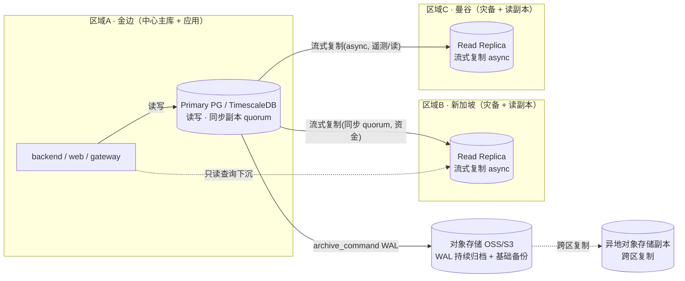
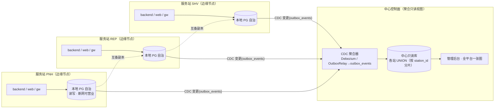
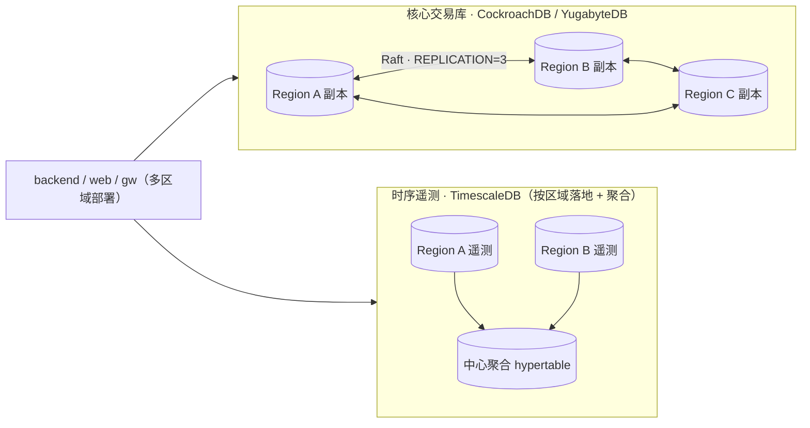
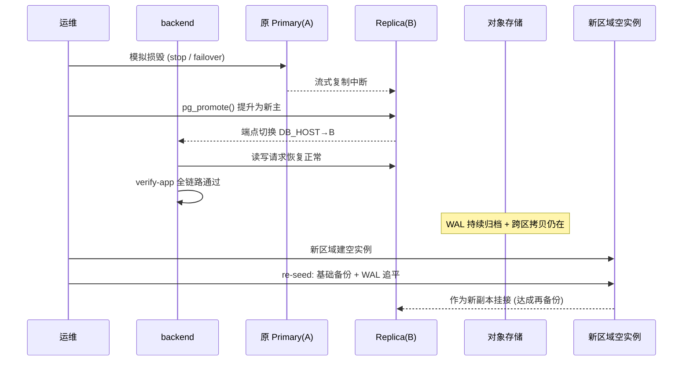

# Claw 平台 · 分布式多区域部署详细设计

> **作者**：高见远（Software Architect）
> **状态**：Draft v1（设计-only，未涉及任何应用源码改动）
> **配套文档**：
> - `分布式部署架构建议.md`（老板诉求 → 路线结论，本文是其正式展开）
> - `云部署与版本切换方案.md`（单主机部署 + `CLAW_VERSION` 版本切换，本文的演进起点）
> - `docs/Phase1-数据库高可用与异地备份落地清单.md`（Phase 1 落地清单，本文第 8 节与之对齐）
> **范围**：仅数据库/部署拓扑/复制/备份/灾备/统一视图设计；不含业务代码改造。

---

## 0. 阅读导航（3 句话）

老板想要的"分布式服务站 + 像一台服务器查各站 + 默认异地备份 + 节点损毁不断服并自动再备份"，本质是 **PostgreSQL 跨区流式复制 + WAL 持续归档 + 故障转移/自动再播种** 的分阶段演进，不必一步到位上 K8s 多活。本文给出 Phase 1（托管 PG + 跨区只读副本 + WAL 异地归档）、Phase 2（边缘节点自治 + 中心 CDC 聚合）、Phase 3（核心交易库换分布式 SQL CockroachDB/YugabyteDB，时序遥测保留 TimescaleDB）三套拓扑与复制、迁移、灾备、统一查询、CAP 的完整设计。所有结论都对齐现有代码事实：数据天然按 `station_id` 分域（`InventoryScope` 已支持平台/站点作用域），且已有 `outbox_events` + `OutboxRelay` 可靠事件源可复用为 CDC 入口。

---

## 1. 执行摘要与需求

### 1.1 业务背景

Claw 是柬埔寨的清洁能源资产共享平台（太阳能板 / 电池 / 车辆 + 无人机）。核心实体"服务站（station）"在地理上分散，老板的运营诉求如下：

1. **在不同服务站建立分布式服务中心**；
2. **总平台集中管理，可像在一台服务器上调取各站数据**；
3. **默认把各站数据备份到不同的区域服务站**；
4. **任一节点损毁，业务照常运营，且数据被迅速再备份到别的服务器**。

平台当前是单站 MVP（金边），已落地的资产见 `云部署与版本切换方案.md`：单机 Docker Compose + 托管优先的 PG/TimescaleDB + nginx 网关 + `scripts/deploy-version.sh`（`CLAW_VERSION`）版本切换。后端经 `DB_HOST/DB_PORT/DB_USER/DB_PASSWORD`（`application.yml` 中 `${DB_HOST:localhost}` 等）接入数据库，前端经网关 `/api` → backend:8080，数据模型通过 `station_id` 列分域（`InventoryScope` 解析可见范围），Flyway 前向迁移（schema 当前停在 v90）由后端启动自动执行。

### 1.2 四条诉求 → 架构目标映射

| # | 老板诉求 | 架构目标（本文对应章节） |
|---|----------|--------------------------|
| ① | 不同服务站建分布式服务中心 | 每个服务站 = 一个**部署单元（边缘节点）**：本地 PG + 后端 + 网关，直接复用现有 `deploy/docker-compose.prod.yml` + `CLAW_VERSION` 版本切换（§8、§9） |
| ② | 总平台集中管理、像一台服务器查各站 | **中心统一视图层**：中心只读副本 + 按 `station_id` 聚合（现有 `InventoryScope` 已天然分域）；Phase 2 用 CDC 把各节点变更汇入中心（§6） |
| ③ | 像在一台服务器上查各站数据 | 物理上中心只读副本 / 联邦查询提供单视图；逻辑上应用层 `station_id` 谓词 + `InventoryScope` 鉴权，平台管理员可见全部站点（§6） |
| ④ | 默认备份到不同区域 + 损毁不断服 + 迅速再备份 | **N 副本复制**（每节点数据默认复制到 ≥2 个其他区域）+ **WAL 持续归档到对象存储并跨区拷贝**；节点损毁 → 副本提升/重定向（业务继续）→ 系统自动把丢失节点的数据**重新播种**到新/备用节点（§3、§5） |

### 1.3 设计原则

- **演进式，不一步到位**：Phase 0（已具备）→ Phase 1（性价比最高，先满足②③④）→ Phase 2（规模化多站）→ Phase 3（终极多活，可选）。
- **DB 层与 App 版本解耦**：Flyway 前向迁移只在中心 Primary 统一执行；副本经复制获得 schema（§4、§9）。
- **资金红线 CP 优先**：核心账户/账本/结算必须同步副本或强校验，绝不允许异步复制导致余额口径漂移（§3、§7）。
- **复用既有能力**：`outbox_events` + `OutboxRelay` 作为 Phase 2 CDC 的可靠事件源；`InventoryScope` 作为统一视图的鉴权基础；`deploy-version.sh` 作为逐节点换版机制。

---

## 2. 拓扑图（Phase 1 / 2 / 3）

> 约定：实线 = 写路径/强一致复制；虚线 = 异步复制/归档；`[( )]` = 数据库，`[ ]` = 应用/服务，`((" "))` = 对象存储。

### 2.1 Phase 1 —— 托管 PG 多可用区 + 跨区只读副本 + WAL 异地归档（最优先）

- **写入**：核心交易（账户/订单/库存/结算/托管）走中心 Primary；资金链路要求同步副本（§3）。
- **读取/灾备**：B、C 为流式副本，可承接只读查询（降低中心延迟），并在 A 损毁时**秒级提升**为新的主。
- **备份**：WAL 实时归档到对象存储并跨区拷贝——这就是"默认备份到不同区域"。即使 A+B 同时毁，C + 对象存储仍可 PITR 恢复（RPO≈0，RTO 分钟级）。

### 2.2 Phase 2 —— 边缘节点自治 + 中心 CDC 聚合（多站规模化）

- **边缘节点**：每个枢纽本地 PG 自治，断网也能做换电/取货等本地业务（写入本地），恢复后增量同步到中心与互备节点。
- **中心聚合**：用**逻辑复制 / Debezium CDC** 把各节点 `outbox_events`（经 `OutboxRelay` 已可靠落库）汇入中心只读库，管理后台在此做"全平台一张图"——实现诉求②。
- **互备**：节点间互为只读副本，满足诉求③"默认备份到不同区域"。

### 2.3 Phase 3 —— 核心库换分布式 SQL（终极多活，可选）

- **核心交易库**：CockroachDB / YugabyteDB，`REPLICATION = 3 区域`，任一区域宕机，数据自动在存活区域**重新均衡再副本**，业务无感——这正是诉求④的"开箱"实现。
- **时序遥测**：仍用 TimescaleDB（hypertable），按区域落地再聚合到中心（与核心库解耦，因 CRDB 不原生支持 TimescaleDB 扩展）。

---

## 3. 数据复制设计

### 3.1 复制形态选择

| 形态 | 适用 | 说明 |
|------|------|------|
| **物理流式复制（Physical Streaming）** | Phase 1 主→副本 | 原生、零额外组件；副本为只读热备，接收与 Primary 完全相同的 WAL 字节，schema 自动一致（§4） |
| **同步 quorum 复制** | 资金/账本写路径 | `synchronous_standby_names = 'ANY 1 (replica_b, replica_c)'`，写需至少 1 个同步副本 ack → RPO=0 |
| **异步流式复制** | 遥测/读副本 | 延迟秒级，允许副本短暂落后；可用性优先 |
| **逻辑复制 / CDC** | Phase 2 边缘→中心 | 按表/行发布 DML；DDL 不自动传播（§4.3 重点） |

### 3.2 同步 quorum 与异步的分工（资金红线）

- **核心资金链路**（账户余额、账本、结算、托管冻结、订单）：使用**同步副本**，`synchronous_standby_names='ANY 1 (b, c)'`。主库提交事务前等待 ≥1 个同步副本落盘，保证任一单区域损毁 **RPO=0**（零数据丢失）。这是"资金绝对准确"红线的硬性保障。
- **非核心遥测 / 只读查询**：异步副本，牺牲强一致换取低延迟与高可用，副本落后几秒可接受。

### 3.3 副本提升（Replica Promotion）

- **托管场景**：控制台"强制故障转移 / promote"即可，RDS/云 PG 自动把副本提升为独立可写实例并切换端点。
- **自建场景**：`SELECT pg_promote(wait => true);`（PG10+）或 `pg_ctl promote`，副本脱离恢复模式变为新主。
- 提升后需：① 把应用 `DB_HOST` 指向新主（或借助 HA 代理 / Patroni 虚拟端点）；② 原主恢复后作为新副本重新挂接（§5.4）。

### 3.4 冗余数学：可承受 N 个区域损毁

设每份数据在 **C 个区域**各存一份完整副本（1 主 + C−1 副本），再叠加对象存储跨区拷贝：

- 可承受同时损毁的区域数 **N = C − 1**（只要还剩 1 份副本即可继续/恢复）。
- 即 **C = N + 1**：要"存活 N 个区域损毁"，每份数据须复制到 **N+1** 个区域。

| 副本数 C | 可承受区域损毁 N | 示例 |
|----------|------------------|------|
| 1（单节点） | 0 | 当前 MVP，机器坏即风险 |
| 2（主 + 1 副本） | 1 | Phase 1 金边主 + 新加坡副本 |
| 3（主 + 2 副本） | 2 | 诉求③"默认备份到 ≥2 个其他区域" → **C=3，可承受 2 区域同时损毁** |

> **叠加对象存储跨区拷贝的兜底**：即便 C 份副本全部损毁（极端灾难），WAL + 基础备份已在异地对象存储（§5），仍可 **PITR 恢复**到最近时间点，数据不丢。因此"副本 C + 对象存储跨区"组合下，实际可承受的损毁规模 ≫ N，仅 RTO 随恢复路径变长而上升。
>
> **同步 quorum 与 N 的关系**：若要求资金路径 RPO=0 且可承受单区域损毁，则用 `ANY 1 (b, c)` 同步——主 + 2 同步副本中坏任意 1 个，另 1 个已 ack，写不丢；坏 2 个则停止写入（保一致，见 §7）。

---

## 4. Schema / 迁移策略（Flyway 只在 Primary）

### 4.1 现状事实

- Flyway 迁移位于 `backend/src/main/resources/db/migration/`，schema 当前停在 **v90**，前向-only（`application.yml`：`spring.flyway.enabled=true`、`ddl-auto: none`、由 Flyway 独占掌管 schema）。
- 后端启动即执行 Flyway（`flyway.enabled=true`）。在分布式拓扑下，**这是必须重新审视的点**（见 4.4）。

### 4.2 物理复制：副本经 WAL 自动获得 schema

Phase 1 用**物理流式复制**：副本接收与 Primary 字节一致的 WAL，因此 Primary 上任何 DDL（含 Flyway 迁移产生的 `CREATE/ALTER`）会自动、逐字节地出现在副本上。**副本无需、也不能自行执行迁移**——schema 是"复制过来的"，不是"跑出来的"。

### 4.3 逻辑复制下的 DDL 处理（Phase 2/3 重点）

逻辑复制（发布/订阅）**只传播 DML，不传播 DDL**。因此 Phase 2 边缘→中心 CDC 时：

- Flyway 在**发布端（边缘主库）**执行 DDL；
- **订阅端（中心只读库）必须同步执行相同 DDL**，否则订阅会因"表不存在/列不匹配"中断。
- 实践：用同一份 Flyway 迁移在两端各自跑（或中心库作为逻辑订阅前先用 `pg_dump --schema-only` 预建 schema），并严格保证两端 Flyway 版本一致（同一 `CLAW_VERSION` 对应同一迁移集，见 §9）。
- `outbox_events` 同样经逻辑复制进入中心，是 CDC 的天然载体（与 `OutboxRelay` 双写语义一致）。

### 4.4 为什么 Flyway 绝不能在只读副本上跑（关键坑）

> **副本是只读的（hot_standby）。** 在流式复制副本上，任何写操作（含 Flyway 的 DDL/`flyway_schema_history` 插入）都会被 PostgreSQL 拒绝：`cannot execute ... in a read-only transaction`。

后果分两种：

1. **物理副本 + 后端直连副本并自动跑 Flyway**：后端 `flyway.enabled=true` 启动时会尝试迁移 → 命中只读事务 → **启动失败 / 健康检查 DOWN**，该节点无法提供服务。
2. **更隐蔽的情况**：若把"应用接入"误配到副本端点且 Flyway 对 `flyway_schema_history` 的写入被静默吞掉，会出现"应用以为迁移成功、实则副本 schema 永远落后主库"的不一致。

**正确做法（中心化迁移）**：

- **Flyway 只在该区域 Primary 上执行**。两套落地方式二选一：
  - (a) **专用 migrate Job**：升级前用一个 `--migrate-only` 一次性 Job（或 `spring.flyway.enabled=true` 仅这次）连 Primary 跑迁移；副本/读路径的应用实例设 `spring.flyway.enabled=false`，仅连 Primary 的那一次才开。
  - (b) **CI 中心执行**：在发布流水线里 `flyway migrate` 指向 Primary 端点，应用实例统一 `flyway.enabled=false`，启动不再碰 schema。
- 副本/中心只读库**完全不参与迁移**，由物理复制（Phase 1）或两端同版本 Flyway（Phase 2）获得 schema。
- 升级前必须对该区域 Primary 做快照（云控制台 / `pg_dump`），回滚前先恢复快照（与 `云部署与版本切换方案.md` §4.3 一致）。

---

## 5. 备份与灾难恢复 Runbook

### 5.1 WAL 持续归档（异地备份的基石）

- 工具：**pgBackRest** 或 **WAL-G**，把 WAL 段与基础备份推到对象存储（OSS / S3）。
- Primary 配置 `archive_mode = on`、`archive_command = 'wal-g wal-push %p'` 或 `pgbackrest --stanza=claw archive-push %p`。
- **跨区拷贝**：OSS 跨区复制 / S3 Cross-Region Replication → WAL 与基础备份自动落到另一区域，满足诉求③"默认备份到不同区域"。

### 5.2 RPO / RTO 目标

| 数据/路径 | 复制方式 | RPO | RTO |
|-----------|----------|-----|-----|
| 资金/账本（同步 quorum） | 同步副本 ANY 1 | **0** | ≤ 60 s（自动 failover） |
| 交易主库（异步副本） | 异步流式 | ≤ 30 s（lag） | ≤ 5 min（promote） |
| 时序遥测（TimescaleDB） | 异步 / 批量 | ≤ 5 min（可接受） | ≤ 15 min |
| 全量 PITR（对象存储） | WAL + 基础备份 | ≈ 0 | ≤ 30 min |

> 注：RTO 含"提升副本 + 应用切换端点 + 健康检查 + 流量放开"全链路；PITR 的 RTO 最长是兜底路径。

### 5.3 故障转移演练步骤（Failover Drill）

> 骨架脚本见 `scripts/dr-drill.sh`（本文 §5.5 引用）。以下为手动步骤。

1. **模拟主库损毁**：控制台强制 failover，或 `pg_ctl stop -m immediate` / `SELECT pg_promote()` 提升副本。
2. **提升副本为新主**：托管控制台 promote，或 `SELECT pg_promote(wait => true);`。
3. **切换应用端点**：把 `deploy/.env.prod` 的 `DB_HOST` 指向新主，或 HA 代理/Patroni 虚拟端点自动切换；`docker compose up -d backend`。
4. **验证业务连续（verify-app）**：`GET /actuator/health` → UP；用演示号登录 → 下单冻结 → 取货履约结算 → 支付回调入账，全链路通过；核对账户余额恒等式（资金零丢失）。
5. **验证 WAL 恢复（pitr-restore）**：从对象存储 PITR 恢复到**新**临时实例，校验关键账户余额恒等式一致。
6. **恢复常态 / 再备份（re-seed）**：原主恢复后作为新副本重新挂接；若原主**永久损毁**，则在新区域建空实例，从另一副本或对象存储 **re-seed**（基础备份 + WAL 追平）成为新副本，完成诉求④"迅速再备份到别的服务器"。

### 5.4 节点损毁 → 业务继续 → 再备份（时序图）

### 5.5 骨架演练脚本（占位云 CLI）

> 文件：`scripts/dr-drill.sh`。含 `usage` 块与 4 个 stub 函数 `failover` / `verify_app` / `pitr_restore` / `re_seed`，云命令以占位 + 注释形式给出，可直接 `bash scripts/dr-drill.sh failover` 调用（详见该文件）。

### 5.6 PITR 恢复流程

1. 在目标区域建恢复实例（同版本 PG/TimescaleDB）。
2. 配置 `wal-g` / `pgbackrest` 指向异地对象存储桶（含跨区副本）。
3. 执行 `wal-g backup-fetch $PGDATA LATEST` 取基础备份；或 `pgbackrest restore`。
4. 设置 `recovery_target_time = '<时间点>'` + `restore_command`，启动进入 PITR 恢复。
5. 校验 `flyway_schema_history` 版本 = v90（或目标版本）、关键账户余额恒等式，放开只读。

---

## 6. 统一查询 / "像一台服务器" 设计

### 6.1 Phase 1：单库 + station_id 聚合（零改造）

Phase 1 所有站数据本就在**同一个 Primary**（中心库）。"像一台服务器"由两个既有能力直接实现：

- **数据分域列**（已实现）：`shared_pool_entries.current_station_id`、`rental_orders.station_id`、`revenue_settlements.station_id`、`fulfillment_orders.station_id`、`inventory.holder_station_id` 等。
- **作用域解析**（已实现）：`InventoryScope` 值对象把"当前登录账号能看到哪些行"抽象为 `ScopeLevel`（PLATFORM / MANUFACTURER / STATION / MERCHANT / NONE）。**平台管理员（PLATFORM）可见全平台**——服务层消费 `ScopeInfo.subordinateStationIds` 拼 `WHERE station_id IN (...)`，天然得到"全平台一张图"。

因此中心只读副本 + 应用层 `station_id` 谓词 + `InventoryScope` 鉴权，即提供"单视图"，**不改业务模型**。管理后台走中心只读副本，读取延迟低、且不影响主库写入。

### 6.2 Phase 2：CDC 聚合的统一视图

规模化后各站数据分散在边缘节点，中心用 CDC 聚合出统一视图：

- 每个边缘节点本地 PG 自治（含自己的 `station_id` 数据）+ 复用 `OutboxRelay` 把领域事件可靠写入本地 `outbox_events`。
- 中心 CDC（Debezium 订阅各边缘 `outbox_events` / 或逻辑复制）把变更汇入**中心只读库**，按 `station_id` 作为分片/分区键。
- 中心只读库 = 各站数据的 UNION → 管理后台在此查询即"像一台服务器"。平台管理员查询不带 `station_id` 过滤即全量；站点管理员带 `station_id` 过滤即本域。
- `OutboxRelay` 的 at-least-once 语义由 handler 幂等吸收，保证聚合最终一致（资金写仍归各边缘主库或中心主库，见 §7）。

### 6.3 "统一视图"与一致性的边界

- **强一致视图**（资金/账户）：仅在中心主库或边缘主库本地读取，保证读到最新已提交值。
- **近实时视图**（全平台一张图 / 遥测）：允许 CDC 延迟（秒级），管理看板可接受最终一致。

---

## 7. CAP 分析（资金 vs 遥测）

| 维度 | 资金/账本路径 | 时序遥测路径 |
|------|--------------|--------------|
| 复制 | 同步 quorum（ANY 1） | 异步流式 / 批量 |
| 优先属性 | **C（一致性）** | **A（可用性）** |
| 分区时行为 | 宁可停写/拒绝请求，也**绝不**返回不一致余额 | 继续读写，可能读到**稍旧**的遥测值 |
| RPO/RTO | RPO=0，RTO≤60s | RPO 秒~分，RTO≤15min |
| 理由 | 资金红线：余额口径漂移 = 资损事故 | 遥测短暂落后不影响业务决策，可用性更重要 |

- **CP 取舍（资金）**：跨区同步复制下，网络分区时若坚持强一致，则分区侧必须**停止写入**（牺牲可用性）。Claw 选择"资金绝对准确 > 资金链路可用性"——分区期间该区域资金写被拒绝并提示重试，但读与遥测不受影响。
- **AP 取舍（遥测）**：异步复制，分区时两边各自可用，允许副本短暂落后；恢复后追平。
- **统一结论**：同一集群内按"数据关键度"分流——核心交易走 CP 同步通道，遥测/日志/看板走 AP 异步通道，而非全局一刀切。

---

## 8. 分阶段 Rollout 与具体云组件

### 8.1 Phase 1（最优先，MVP 后即可做）

| 能力 | 推荐云组件（阿里云 / AWS / 腾讯云） | 说明 |
|------|--------------------------------------|------|
| 主库 | RDS PostgreSQL（开启 TimescaleDB 插件）/ RDS for PostgreSQL / 云数据库 PostgreSQL | 多可用区（Multi-AZ）高可用，主备自动故障转移 |
| 跨区只读副本 | RDS 只读实例（跨地域）/ Read Replica（另一 Region）/ 跨地域只读实例 | 承接只读 + 灾备，主坏秒级提升 |
| 持续备份 | 自动备份 + PITR（归档到 OSS/S3） | WAL 实时归档 |
| 跨区拷贝 | OSS 跨区复制 / S3 Cross-Region Replication | WAL 与备份落另一区域 |
| 自动故障转移（可选自建） | Patroni + etcd / CloudNativePG 算子 | 托管最省心，推荐起步用托管 |

- **改动面**：仅改 `deploy/.env.prod` 的 `DB_HOST` 等指向托管主库端点，后端 `application.yml` 已用环境变量，**不改代码**。
- **验收**：同 `docs/Phase1-数据库高可用与异地备份落地清单.md` §8。

### 8.2 Phase 2（多站规模化）

- 每个服务站跑**边缘节点**：复用 `deploy/docker-compose.prod.yml` + `CLAW_VERSION`（本地 PG 自治 + 后端 + 网关）。
- 中心：Debezium（或逻辑复制订阅 `outbox_events`）→ 中心 TimescaleDB/PG 只读库聚合。
- 节点间互备副本（满足诉求③）。

### 8.3 Phase 3（终极多活，可选）

- 核心交易库：CockroachDB / YugabyteDB，`REPLICATION = 3 区域`，自动重均衡再副本。
- 时序遥测：保留 TimescaleDB（hypertable），按区域落地再聚合到中心。
- 应用层：`CLAW_VERSION` 多区域部署，连接分布式 SQL 端点。

### 8.4 演进不建议

- **不要一步到位上 K8s 多活**：MVP 阶段 Compose + 托管 PG 最务实，K8s 复杂度与成本陡增（见 `云部署与版本切换方案.md` §2.1）。

---

## 9. 与现有版本切换机制（CLAW_VERSION / deploy-version.sh）的结合

- **每节点通用**：中心与各边缘节点各自持有 `deploy/.env.prod`，改 `CLAW_VERSION` + `./scripts/deploy-version.sh deploy <版本>` 即可**逐节点换版**（前端后端共用同一版本号，保证接口契约对齐）。
- **DB 层不随 App 版本切换**：`数据库由 Flyway 前向迁移管理`，升级若带新迁移（V91+），**回滚前必须先恢复该次升级前的 DB 快照**，否则旧应用镜像可能不兼容已应用的新 schema（见 `云部署与版本切换方案.md` §4.3）。
- **Flyway 中心化执行**：分布式下，Flyway 由**中心 Primary**统一执行（§4.4），副本/读路径实例 `flyway.enabled=false`；两端（Phase 2 逻辑复制）用同一 `CLAW_VERSION` 对应的同一迁移集，保证 schema 一致。
- **upgrade 前快照规则强化**：多节点下升级前**对每个区域主库**各做一次快照（云控制台 / `pg_dump`），回滚规则同单站方案但逐区域执行。
- **re-seed 复用 Flyway**：丢失节点重建为新副本后，新主上的 Flyway 已是最新 schema，新副本经复制获得；若是逻辑复制订阅端，则需在订阅端补跑同版本 Flyway（§4.3）。

---

## 10. 风险与未决问题

### 10.1 风险

| 风险 | 影响 | 缓解 |
|------|------|------|
| 跨区同步副本延迟 | 资金路径 RPO=0 但写延迟升高 | 选地理邻近区域（金边→新加坡）；`ANY 1` quorum 降低等待数 |
| 逻辑复制 DDL 不传播 | Phase 2 订阅端 schema 漂移致 CDC 中断 | 两端同版本 Flyway；迁移前预建 schema |
| Flyway 误连副本 | 后端启动失败 / 只读事务报错 | 中心化迁移；副本实例 `flyway.enabled=false`（§4.4） |
| CockroachDB 不兼容 TimescaleDB | Phase 3 时序能力丢失 | 遥测保留独立 TimescaleDB（§2.3） |
| 大表迁移锁 | v90 后 DDL 锁业务 | 低峰期 + 在线 DDL（如 `CONCURRENTLY` 索引） |
| Outbox 膨胀 / CDC  lag | 聚合延迟 | outbox 定期清理；监控 `next_attempt_at` / 死信台 |

### 10.2 未决问题（需老板/团队决策）

1. **数据驻留合规**：柬埔寨数据跨境到新加坡/曼谷副本是否违反当地数据驻留法规？若必须留境，则"跨区"改为境内多可用区 + 境外仅存加密 WAL 备份。
2. **区域选型**：金边之外选哪两个区域做副本/再备份（新加坡？曼谷？胡志明？）取决于延迟与合规。
3. **同步副本数量**：资金路径用 `ANY 1` 还是 `ALL 2` 同步（一致性与延迟的再权衡）。
4. **Phase 3 触发条件**：何时从"PG 复制"升级到"分布式 SQL"？建议以"站点数 ≥ 5 且跨区写冲突频繁"为阈值。
5. **中心聚合的写归属**：Phase 2 平台级写（如跨站调拨）落在中心主库还是源站主库？影响一致性模型。
6. **成本预算**：托管多区域 PG + 对象存储跨区拷贝 + 可选 CockroachDB 的月度成本需财务确认。

---

## 附录 A：本文与既有文档关系

- `分布式部署架构建议.md`：路线结论，本文为其正式展开（拓扑/复制/迁移/灾备/统一视图/CAP 全补完）。
- `云部署与版本切换方案.md`：单主机部署 + `CLAW_VERSION` 切换，本文 Phase 0 起点与 §9 复用对象。
- `docs/Phase1-数据库高可用与异地备份落地清单.md`：Phase 1 落地清单，本文 §8.1 与之对齐，验收标准共引。
- `scripts/dr-drill.sh`：本文 §5.5 引用的灾备演练骨架脚本（占位云 CLI）。
- 代码事实锚点：`InventoryScope`（平台/站点作用域）、`outbox_events`+`OutboxRelay`（CDC 源）、`station_id` 分域列、`application.yml`（`${DB_HOST}` 等环境变量接入）、Flyway v90 前向-only。
