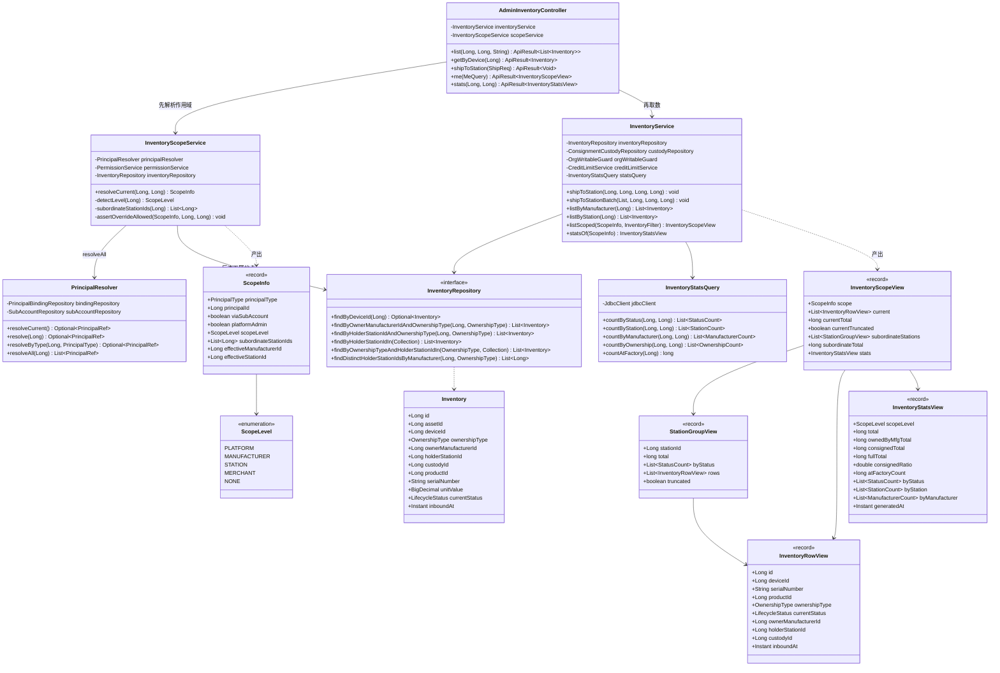
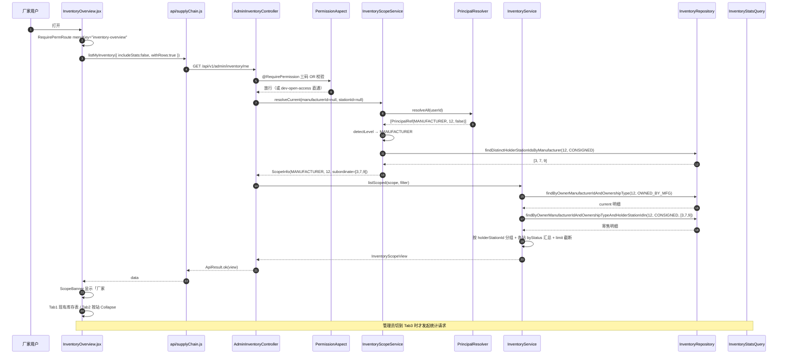
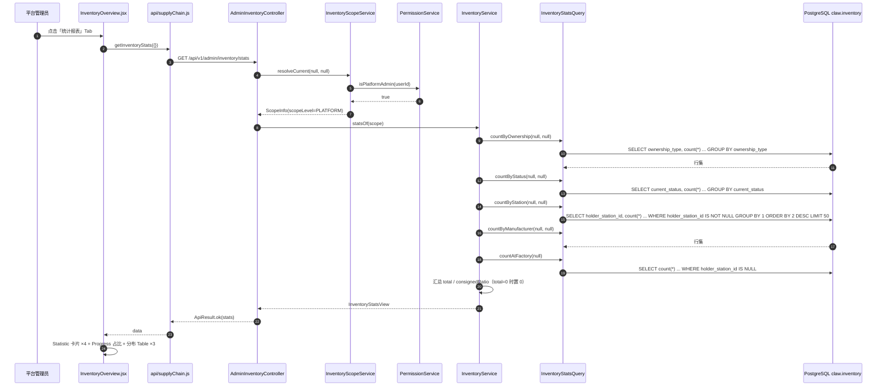
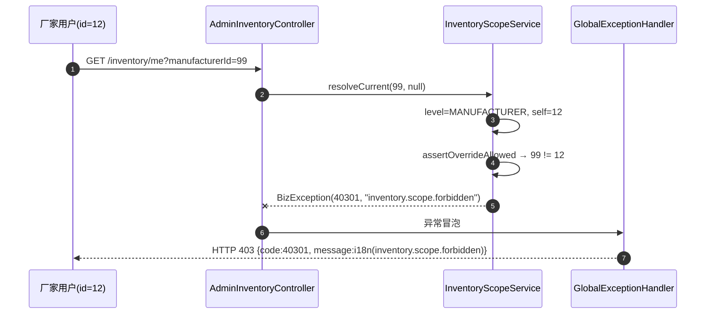
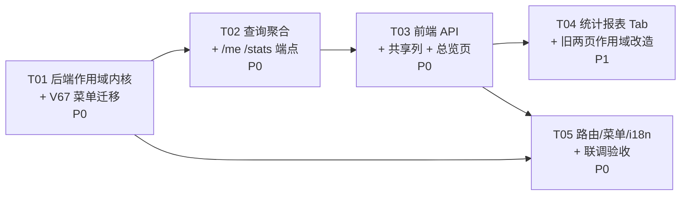

# 增量设计 · 模块三：供应流通库存改造（角色感知双视图 + 管理员统计）

> 架构师：高见远（Gao） · 团队：爪平台软件开发团队
> 目标工程：`/Users/zhoutianzhi/WorkBuddy/Claw/claw-platform`（严格集成，禁止新建平行工程）
> 前置：模块一（布局滚动 + 旧菜单清理）、模块二（真实数据库环境打通）已交付
> 文档状态：待周老板对 H 章节拍板后进入实施

## 0. 需求锚点（周老板原话）

> 供应流通库存改造：厂家库存/寄售库存 → 现有库存/服务站库存；自动展示自己与下属服务站库存，上级看下级全部，管理员看全部 + 统计报表。

拆解为四项可验收能力：

| 编号 | 能力 | 验收口径 |
|---|---|---|
| M3-1 | 角色感知库存双视图 | 页面呈现「现有库存」/「服务站库存」两个视图，命名不再出现"厂家库存/寄售库存" |
| M3-2 | 自动作用域 | 登录后无需手选厂家/站点即出数；手选仅作为管理员/厂家的增强筛选 |
| M3-3 | 上级看下级全部 | 厂家可见其全部下属服务站库存；管理员可见全平台 |
| M3-4 | 管理员统计报表 | 设备总数、生命周期分布、站点分布、厂家分布、寄售 vs 自有占比 |

---

## A. 实现方案与框架选型

### A.1 沿用既有技术栈（零新框架）

| 层 | 选型 | 说明 |
|---|---|---|
| 后端 | Java 21 + Spring Boot 3 + Spring Data JPA | 沿用 `com.claw.server` 分层：`web/v1` → `domain/*` → Repository |
| 只读聚合 | `org.springframework.jdbc.core.simple.JdbcClient` | 工程已有先例（`OrgWritableGuard.find()` 读 `v_org_governance`）；统计聚合走 JdbcClient 而非 JPQL，理由见 A.4 |
| 权限 | `@RequirePermission` + `PermissionAspect` + `PermissionService.isPlatformAdmin` | 已核实 `PermissionAspect` 支持 `"*"` 通配符与 `dev-open-access` 放行 |
| 主体解析 | `domain/role/PrincipalResolver` | 已核实存在 `resolveCurrent/resolve/resolveByType/resolveCurrentOrThrow` |
| 前端 | React 18 + antd 5 + react-i18next | 沿用 `PageCard`/`Perm`/`RequirePermRoute`/`EnumTag`/`useSupplyOptions` |
| 图表 | **不引入图表库** | 统计报表用 antd `Statistic`/`Progress`/`Table` 表达，保证依赖包新增为零（见 F） |

### A.2 四个核心技术难点与决策

#### 难点 1：当前登录主体未知（`AuthContext` 只有 userId）

已核实事实：`AuthContext.currentUser()` 返回 `ClawUser(userId, phone, roleSummary)`，不含绑定的厂家/站点 ID。工程内已有 `PrincipalResolver` 可从 `principal_bindings` + `sub_accounts` 回溯主体。

**已核实的一处缺陷（重要）**：`PrincipalResolver.resolveByType(userId, type)` 的实现是
```java
return resolve(userId).filter(ref -> ref.type() == type);
```
而 `resolve()` → `compute()` 按 `MANUFACTURER → STATION → MERCHANT` 固定优先级**只返回第一个命中**。因此一个既绑定厂家又绑定服务站的账号，`resolveByType(uid, STATION)` 会返回 `empty`，而不是它真实的站点绑定。

**决策**：模块三**不修改** `resolveByType`（会连带改变 `OrgWritableGuard.assertApplicantCanApply` 的既有行为，属跨模块风险），而是**新增只读方法** `resolveAll(Long userId): List<PrincipalRef>`——返回该账号的**全部**主体绑定（主账号多绑定 + 子账号回溯）。作用域计算消费 `resolveAll`，语义正确且对既有链路零影响。
- `resolveAll` **不复用**现有单值缓存键 `principal:{userId}`（结构为 `TYPE:id:0/1` 单值，无法承载多值），本轮直查 DB。库存页是低频读接口，可接受；是否加 `principal:all:{userId}` 缓存见 H-9。

#### 难点 2：「下属服务站」在数据模型中不存在静态从属关系

已核实 `domain/station/Station` 实体字段：`id/code/name/area/countryCode/province/city/district/lat/lng/status/openHours/operatorId/tenantId/onboardingStatus/onboardingApplicationId/depositTierId/creditLimit/disabledAt/disabledBy/disabledReason/signboardUrl/geoAddress/deleted/createdAt/updatedAt`。

**没有 `parent_station_id`，也没有 `manufacturer_id`。** 即：
- 服务站之间是**扁平**的，不存在"下级站点"；
- 厂家与服务站之间**没有签约/挂靠关系表**。

**决策**：「下属服务站」按**业务数据动态反查**——
```
厂家 M 的下属服务站 = distinct(inventory.holder_station_id)
                      where owner_manufacturer_id = M
                        and ownership_type = CONSIGNED
                        and holder_station_id is not null
```
语义即"我的货现在寄在哪些站"，等价于 `consignment_custodies` 中 `manufacturer_id = M and ended_at is null` 的 `holder_station_id` 集合。为避免跨域依赖，本模块从 `inventory` 台账反查（台账与 custody 1:1，且 `InventoryService` 本就持有 `InventoryRepository`）。

⚠️ 该口径的副作用：**从未发过货的厂家，下属服务站为空**（不是"有签约站但库存为 0"）。若周老板要求"签约即为下属，哪怕零库存"，需新建厂商-站点关联表（V67 建表），已超出模块三"只改视图与作用域"的边界 → 列入 **H-3** 拍板。

#### 难点 3：不新增表的前提下做全平台聚合

**决策：不新增任何业务表，Flyway 仅新增一支菜单权限种子迁移 `V67`（纯 `INSERT ... ON CONFLICT DO NOTHING` + 一条幂等 `UPDATE roles.grants`，无 DDL）。**
- 列表查询：`InventoryRepository` 追加 JPA 派生查询（`findByHolderStationIdIn`、`findByOwnerManufacturerIdAndOwnershipTypeAndHolderStationIdIn` 等）。
- 统计聚合：新增 `InventoryStatsQuery`（JdbcClient 只读投影），**不把全表捞进内存做 Stream 分组**——管理员视角是全平台量级，Stream 分组会 OOM/超时。

#### 难点 4：为何统计用 JdbcClient 而不是 JPQL `@Query`

作用域有 3 种（全平台 / 厂家 / 站点）× 5 个聚合维度 = 15 种组合。若走 JPQL，条件可空需要写成 `(:mfgId is null or i.ownerManufacturerId = :mfgId)`，在 PostgreSQL + Hibernate 6 下对 `null` 参数常需显式 `cast`，且 5 个 `group by` 投影要各写一遍派生接口，维护成本高。JdbcClient 可用同一段 SQL 骨架 + 动态 `WHERE` 片段覆盖全部组合，且工程已有先例，团队认知成本为零。

### A.3 视图口径（M3-1 的核心定义）

| 登录主体 | 「现有库存」current | 「服务站库存」subordinateStations |
|---|---|---|
| 厂家 MANUFACTURER | `owner_manufacturer_id = me AND ownership_type = OWNED_BY_MFG` | `owner_manufacturer_id = me AND ownership_type = CONSIGNED`，按 `holder_station_id` 分组 |
| 服务站 STATION | `holder_station_id = me AND ownership_type = CONSIGNED` | 空（模型扁平，无下级站）；前端隐藏该 Tab |
| 平台管理员 PLATFORM | `ownership_type = OWNED_BY_MFG`（全平台厂家在库） | `ownership_type = CONSIGNED` 全平台，按 `holder_station_id` 分组 |
| 商家 MERCHANT | 空（库存域无商家数据） | 空 |
| 无绑定 NONE | 空 + 前端引导文案（不返回 403） | 空 |

**关键取舍**：厂家的「现有库存」**只含 `OWNED_BY_MFG`，不含已寄售在站的 `CONSIGNED`**。理由：同一台设备若同时出现在「现有库存」和「服务站库存」，两个视图数量相加会双计，管理员报表口径也会失真。`FULL`（已买断售出）不进任何库存视图，只在统计的 `fullTotal` 中体现。→ 该口径请周老板确认（**H-2**）。

**NONE 不报 403 的理由**：`dev-open-access=true` 时 `PermissionAspect` 直接放行，但主体仍可能解析不出来；若此时抛 403，本地真实库联调会白屏，违背模块二"真实库可跑通"的既有成果。故返回 `scopeLevel=NONE` + 空列表，由前端显示"当前账号未绑定业务主体，请前往主体绑定"的引导。

### A.4 权限与安全

- 新增两个读端点，权限码**完全复用**，不新增权限位：
  `@RequirePermission({"mfg:inventory:own", "mfg:inventory:consignment:view", "station:consignment:view"})`（OR 语义，与既有 `GET /api/v1/admin/inventory` 一致）。平台管理员通过 `"*"` 通配符命中。
- **越权覆盖失败关闭**：`manufacturerId`/`stationId` 是"增强筛选"入参，服务端二次校验——
  - `PLATFORM`：任意值放行；
  - `MANUFACTURER`：`manufacturerId` 只能等于自身 id；`stationId` 必须属于自身下属站点集合；
  - `STATION`：`stationId` 只能等于自身 id，`manufacturerId` 忽略（可选：仅按厂家过滤本站货，属只读收窄，安全）；
  - 违反则抛 `BizException.of(40301, "inventory.scope.forbidden")`。
- **敏感字段不下发**：`Inventory.unitValue / valueCurrency / unitValueSource` 属授信额度域（增量 C）字段，库存视图 DTO **一律不含**。既有 `GET /api/v1/admin/inventory` 直返 `Inventory` 实体已泄露该字段，本轮新端点用显式 DTO 收口（旧端点是否同步收口见 H-7）。
- **完全不触碰货权/占有权真源**：`shipToStation` / `shipToStationBatch` / `OrgWritableGuard` / `CreditLimitService` / `ConsignmentCustody` 写链路**零改动**。模块三新增代码全部 `@Transactional(readOnly = true)`。

### A.5 编译约束

新增代码仅使用 Java 21 语法（`record`、`switch` 表达式、`List.of`、密封性不使用），不引入预览特性。本地若只有 JDK 26，按既有 `jvm-higher-jdk-compile-verify` 约定加 Byte Buddy 实验开关 `-Dnet.bytebuddy.experimental=true` 并强制 Lombok 注解处理器加载后编译验证。

---

## B. 文件清单（相对 `claw-platform/`）

### B.1 后端（新增 5 / 改动 4）

| 状态 | 路径 | 职责 |
|---|---|---|
| 新增 | `backend/src/main/java/com/claw/server/domain/inventory/InventoryScope.java` | `ScopeLevel` 枚举 + `ScopeInfo` record（作用域值对象） |
| 新增 | `backend/src/main/java/com/claw/server/domain/inventory/InventoryScopeService.java` | 主体解析 → 作用域计算 → 越权校验 → 下属站点反查 |
| 新增 | `backend/src/main/java/com/claw/server/domain/inventory/InventoryStatsQuery.java` | JdbcClient 只读聚合（5 个维度，支持作用域收窄） |
| 新增 | `backend/src/main/java/com/claw/server/common/dto/InventoryViews.java` | 全部出参 DTO（沿用 `common/dto/*Views.java` 命名惯例） |
| 新增 | `backend/src/main/resources/db/migration/V67__inventory_overview_menu_seed.sql` | 菜单权限码种子（**无 DDL、无建表**） |
| 改动 | `backend/src/main/java/com/claw/server/domain/role/PrincipalResolver.java` | **仅追加** `resolveAll(Long userId): List<PrincipalRef>`；既有方法不动 |
| 改动 | `backend/src/main/java/com/claw/server/domain/inventory/InventoryRepository.java` | 追加派生查询（`...HolderStationIdIn` 等）+ 1 个 distinct 站点 JPQL |
| 改动 | `backend/src/main/java/com/claw/server/domain/inventory/InventoryService.java` | 追加 `listScoped(...)` / `statsOf(...)`；`shipToStation*` 链路零改动 |
| 改动 | `backend/src/main/java/com/claw/server/web/v1/AdminInventoryController.java` | 追加 `GET /me`、`GET /stats`；既有 3 个端点零改动 |
| 改动 | `backend/src/main/resources/i18n/messages_zh.properties`<br>`backend/src/main/resources/i18n/messages_en.properties`<br>`backend/src/main/resources/i18n/messages_km.properties` | 追加 `inventory.scope.forbidden`（已核实 `inventory.not.found` 在 `messages_zh.properties:167`，同节追加即可） |

### B.2 前端（新增 2 / 改动 9）

| 状态 | 路径 | 职责 |
|---|---|---|
| 新增 | `web/src/pages/InventoryOverview.jsx` | 库存总览页：现有库存 / 服务站库存 / 统计报表 三 Tab |
| 新增 | `web/src/components/inventoryShared.jsx` | `useInventoryColumns()` 列工厂 + `ScopeBanner` 作用域提示条（三页共用，防列定义漂移） |
| 改动 | `web/src/api/supplyChain.js` | 追加 `listMyInventory` / `getInventoryStats` |
| 改动 | `web/src/pages/MfgInventory.jsx` | 首屏默认走自动作用域；手选厂家后回落原 `listInventory` |
| 改动 | `web/src/pages/StationConsignment.jsx` | 同上（按站点） |
| 改动 | `web/src/nav.js` | `supply.children` 首位插入 `inventory-overview`；`ROUTES` 追加 `/inventory-overview` |
| 改动 | `web/src/App.jsx` | 追加 `<Route path="inventory-overview" element={<RequirePermRoute menuKey="inventory-overview">…}` |
| 改动 | `web/src/enums.js` | 追加 `SCOPE_LEVEL_LABEL`（作用域标签映射） |
| 改动 | `web/src/i18n/locales/zh/supply.json` | 追加 `inventoryOverview.*` 文案节 |
| 改动 | `web/src/i18n/locales/en/supply.json` | 同上（三语齐全，缺一即回退显示 key） |
| 改动 | `web/src/i18n/locales/km/supply.json` | 同上 |
| 改动 | `web/src/i18n/locales/{zh,en,km}/nav.json` | 追加 `item.inventory-overview` |

---

## C. 数据结构与接口

### C.1 接口清单

| 方法 | 路径 | 权限 | 用途 |
|---|---|---|---|
| GET | `/api/v1/admin/inventory/me` | `mfg:inventory:own` \| `mfg:inventory:consignment:view` \| `station:consignment:view` | 角色作用域双视图（M3-1/2/3） |
| GET | `/api/v1/admin/inventory/stats` | 同上 | 统计报表（M3-4） |

保持不变：`GET /api/v1/admin/inventory`、`GET /api/v1/admin/inventory/device/{deviceId}`、`POST /api/v1/admin/inventory/ship`。

### C.2 `GET /api/v1/admin/inventory/me`

**请求参数（全部可选）**

| 参数 | 类型 | 默认 | 说明 |
|---|---|---|---|
| `manufacturerId` | Long | null | 增强筛选；非 PLATFORM 时受 A.4 越权校验约束 |
| `stationId` | Long | null | 增强筛选；传值时 `subordinateStations` 只返回该站 |
| `status` | String | null | `LifecycleStatus` 枚举名，过滤 `current_status` |
| `ownershipType` | String | null | 覆盖默认口径（管理员排障用），非法值抛 400 |
| `includeStats` | boolean | false | true 时同请求带回 `stats` 段，省一次往返 |
| `withRows` | boolean | true | false 时 `subordinateStations[].rows` 返回空数组，仅给汇总（首屏加速） |
| `limit` | Integer | 500 | 单视图明细行上限（保护），截断时置 `truncated=true` |

**响应体 `InventoryScopeView`**

```json
{
  "code": 0, "message": "ok",
  "data": {
    "scope": {
      "principalType": "MANUFACTURER",
      "principalId": 12,
      "viaSubAccount": false,
      "platformAdmin": false,
      "scopeLevel": "MANUFACTURER",
      "subordinateStationIds": [3, 7, 9],
      "effectiveManufacturerId": 12,
      "effectiveStationId": null
    },
    "current": [ { "...": "InventoryRowView" } ],
    "currentTotal": 128,
    "currentTruncated": false,
    "subordinateStations": [
      {
        "stationId": 3,
        "total": 40,
        "byStatus": [ { "status": "AT_STATION", "count": 38 }, { "status": "SOLD", "count": 2 } ],
        "rows": [ { "...": "InventoryRowView" } ],
        "truncated": false
      }
    ],
    "subordinateTotal": 88,
    "stats": null
  }
}
```

**`InventoryRowView`**（`Inventory` 的安全只读投影，字段名与实体一致以便前端列定义零改造）

| 字段 | 类型 | 来源 |
|---|---|---|
| `id` | Long | `inventory.id` |
| `assetId` | Long | `inventory.asset_id` |
| `deviceId` | Long | `inventory.device_id` |
| `serialNumber` | String | `inventory.serial_number` |
| `productId` | Long | `inventory.product_id` |
| `ownershipType` | String(enum) | `OwnershipType` |
| `currentStatus` | String(enum) | `LifecycleStatus` |
| `ownerManufacturerId` | Long | `inventory.owner_manufacturer_id` |
| `holderStationId` | Long | `inventory.holder_station_id` |
| `custodyId` | Long | `inventory.custody_id`（占有权真源外键，详情弹窗用） |
| `inboundAt` | Instant | ISO-8601 UTC |
| `updatedAt` | Instant | ISO-8601 UTC |

> **不含** `unitValue` / `valueCurrency` / `unitValueSource`（授信域敏感字段，见 A.4）。
> **不含** 名称字段：`productName`/`stationName`/`manufacturerName` 由前端 `useSupplyOptions()` 本地解析（既有约定，见 G）。

### C.3 `GET /api/v1/admin/inventory/stats`

**请求参数**：`manufacturerId`(可选)、`stationId`(可选)。未传时按当前主体自动收窄；PLATFORM 未传 = 全平台。

**响应体 `InventoryStatsView`**

```json
{
  "scopeLevel": "PLATFORM",
  "total": 1024,
  "ownedByMfgTotal": 300,
  "consignedTotal": 700,
  "fullTotal": 24,
  "consignedRatio": 0.6836,
  "atFactoryCount": 300,
  "stationCount": 17,
  "manufacturerCount": 5,
  "byStatus": [ { "status": "AT_STATION", "count": 700 }, { "status": "IN_FACTORY", "count": 300 } ],
  "byStation": [ { "stationId": 3, "count": 40 } ],
  "byManufacturer": [ { "manufacturerId": 12, "count": 520 } ],
  "byOwnership": [ { "ownershipType": "CONSIGNED", "count": 700 } ],
  "generatedAt": "2026-09-05T08:12:33Z"
}
```

字段说明：
- `consignedRatio`：`consignedTotal / total`，**由后端计算**（total=0 时返回 0，避免前端除零）；
- `atFactoryCount`：`holder_station_id IS NULL` 的行数（尚未下发到站的厂家在库）；
- `stationCount` / `manufacturerCount`：`byStation` / `byManufacturer` 的基数，供 Statistic 卡片直接展示；
- `byStation` / `byManufacturer` 按 `count` 倒序，服务端截断为 **Top 50**（超出部分前端不展示，避免全平台上千站点撑爆响应）。

### C.4 主体解析方案（明确决策）

采用**新建 `InventoryScopeService`** 方案，而非在 `InventoryService` 里注入 `PrincipalResolver`：

- **理由 1（单一职责）**：`InventoryService` 已承载发货写链路 + 授信/禁用守卫，再塞入"我是谁"的解析会让这个类同时负责鉴权语义与库存语义，后续模块四（服务站功能）也需要同一套作用域，会重复。
- **理由 2（复用）**：`InventoryScopeService` 是通用能力，模块四可直接复用。
- **理由 3（可测）**：作用域计算是纯逻辑，可独立单测（mock `PrincipalResolver` + `PermissionService`）。

`InventoryService` 只追加两个只读方法 `listScoped(ScopeInfo, filters)` / `statsOf(ScopeInfo)`，**由 Controller 先调 `InventoryScopeService.resolve(...)` 拿到 `ScopeInfo` 再传入**——服务层不隐式读 `AuthContext`，便于测试。

### C.5 类图



### C.6 前端 API 契约

```js
// web/src/api/supplyChain.js（追加）

/** 角色作用域库存双视图（模块三 · M3-1/2/3）。 */
export const listMyInventory = ({ manufacturerId, stationId, status, ownershipType,
                                  includeStats, withRows, limit } = {}) =>
  api.get('/v1/admin/inventory/me', {
    params: cleanParams({ manufacturerId, stationId, status, ownershipType,
                          includeStats, withRows, limit }),
  });

/** 库存统计报表（模块三 · M3-4，管理员/厂家）。 */
export const getInventoryStats = ({ manufacturerId, stationId } = {}) =>
  api.get('/v1/admin/inventory/stats', { params: cleanParams({ manufacturerId, stationId }) });
```

### C.7 V67 迁移骨架（无 DDL）

```sql
-- V67__inventory_overview_menu_seed.sql
SET search_path = claw;

-- 1) 新页面菜单码：sort_no=450 天然排在 production(451) 之前，无需 UPDATE 既有行
INSERT INTO permissions (code, name, ptype, parent_code, path, sort_no) VALUES
  ('menu:inventory-overview', '库存总览', 'MENU', 'menu:supply', '/inventory-overview', 450)
ON CONFLICT (code) DO NOTHING;

-- 2) 挂进角色模板（厂家 / 服务站 / 平台管理员）
INSERT INTO role_template_permissions (template_code, permission_code) VALUES
  ('MANUFACTURER',   'menu:inventory-overview'),
  ('STATION',        'menu:inventory-overview'),
  ('PLATFORM_ADMIN', 'menu:inventory-overview')
ON CONFLICT (template_code, permission_code) DO NOTHING;

-- 3) 回写 roles.grants（沿用 V54 第 6 段口径：只覆盖 MANUFACTURER/STATION，
--    CUSTOMER 的 grants 是 V11 的对象结构，动了会清空老用户权限）
UPDATE roles r
   SET grants = COALESCE(
       (SELECT to_jsonb(array_agg(tp.permission_code))::text
          FROM role_template_permissions tp
         WHERE tp.template_code = r.code), '[]')
 WHERE r.code IN ('MANUFACTURER', 'STATION');
```

---

## D. 程序调用流程

### D.1 库存总览页首屏（厂家视角）



### D.2 管理员统计报表



### D.3 越权覆盖被拒（失败关闭）



---

## E. 任务列表（有序，含依赖）

> 严格 5 个任务；每个任务 ≥3 个文件；配置/迁移集中在 T01；除 T01 外尽量只依赖 T01。

### T01 · 后端作用域内核与菜单迁移 — P0，无依赖

| 项 | 内容 |
|---|---|
| 源文件 | `backend/.../domain/inventory/InventoryScope.java`（新）<br>`backend/.../domain/inventory/InventoryScopeService.java`（新）<br>`backend/.../domain/role/PrincipalResolver.java`（改：追加 `resolveAll`）<br>`backend/.../domain/inventory/InventoryRepository.java`（改：追加派生查询 + distinct 站点 JPQL）<br>`backend/src/main/resources/db/migration/V67__inventory_overview_menu_seed.sql`（新） |
| 交付 | `ScopeLevel`/`ScopeInfo` 定型；`resolveAll` 返回全部绑定；作用域计算 + 越权校验 + 下属站点反查可单测通过；V67 幂等可重复执行 |
| 验收 | `mvn -q compile` 通过；`InventoryScopeServiceTest` 覆盖 5 种 ScopeLevel + 3 类越权拒绝；Flyway 从 v66 升到 v67 无报错，重复执行无副作用 |
| 风险 | `resolveAll` 必须**只新增**，不得改动 `resolve/compute/resolveByType`（`OrgWritableGuard` 依赖其现有语义） |

### T02 · 后端查询聚合与两个新端点 — P0，依赖 T01

| 项 | 内容 |
|---|---|
| 源文件 | `backend/.../common/dto/InventoryViews.java`（新：全部出参 record）<br>`backend/.../domain/inventory/InventoryStatsQuery.java`（新：JdbcClient 聚合）<br>`backend/.../domain/inventory/InventoryService.java`（改：追加 `listScoped`/`statsOf`）<br>`backend/.../web/v1/AdminInventoryController.java`（改：追加 `GET /me`、`GET /stats`）<br>`backend/src/main/resources/i18n/messages_{zh,en,km}.properties`（改：`inventory.scope.forbidden`） |
| 交付 | 两个端点按 C.2/C.3 契约出数；`@RequirePermission` 三码 OR；敏感货值字段不下发；`limit` 截断与 `truncated` 标记生效 |
| 验收 | curl 三种角色（厂家/站点/管理员）各得到正确口径；越权 `manufacturerId` 返回 403/40301；`ship` 链路回归测试全绿（零改动证明） |
| 风险 | 严禁在 `InventoryService` 的 `shipToStation*` 方法体内做任何改动；新方法全部 `@Transactional(readOnly = true)` |

### T03 · 前端 API + 共享列组件 + 库存总览页 — P0，依赖 T02（可按 C.2 契约先行开发）

| 项 | 内容 |
|---|---|
| 源文件 | `web/src/api/supplyChain.js`（改：`listMyInventory`/`getInventoryStats`）<br>`web/src/components/inventoryShared.jsx`（新：`useInventoryColumns()` + `ScopeBanner`）<br>`web/src/pages/InventoryOverview.jsx`（新：Tab1 现有库存 / Tab2 服务站库存）<br>`web/src/enums.js`（改：`SCOPE_LEVEL_LABEL`） |
| 交付 | 首屏零手选出数；Tab2 用 antd `Collapse`（items API）按站分组，面板头显示站名 + 总数 + 状态 Tag；`scopeLevel=NONE` 时显示引导 `Empty`/`Alert`（不白屏）；`STATION` 视角隐藏 Tab2 |
| 验收 | `npm run build` 无警告；三种角色截图核对；列定义唯一来源为 `inventoryShared.jsx` |
| 风险 | 列工厂需同时满足新页与旧两页的列集差异（用 `{ variant: 'current' \| 'station' }` 入参控制），避免旧页回归 |

### T04 · 管理员统计报表 Tab + 旧两页自动作用域改造 — P1，依赖 T03

| 项 | 内容 |
|---|---|
| 源文件 | `web/src/pages/InventoryOverview.jsx`（改：追加 Tab3 统计报表）<br>`web/src/pages/MfgInventory.jsx`（改：首屏走 `listMyInventory`）<br>`web/src/pages/StationConsignment.jsx`（改：同上） |
| 交付 | Tab3 仅 `scope.platformAdmin === true` 时渲染（`Perm` 兜底 + 后端二次收窄）；4 张 `Statistic` 卡（总数/自有/寄售/在厂未下发）+ 寄售占比 `Progress` + 3 张分布 `Table`；旧两页未手选时自动作用域、手选后回落既有 `listInventory` |
| 验收 | 管理员看到全平台数字与 SQL 手算一致；非管理员看不到 Tab3；旧两页发货/合格证/占有权详情弹窗功能无回归 |
| 风险 | 不引入任何图表库（见 F）；旧两页改造必须保留原有 `Select` 手选与 `shipToStation` 弹窗 |

### T05 · 路由 / 菜单 / 三语 i18n + 联调验收 — P0，依赖 T01、T03

| 项 | 内容 |
|---|---|
| 源文件 | `web/src/App.jsx`（改：注册 `/inventory-overview` + `RequirePermRoute`）<br>`web/src/nav.js`（改：`supply.children` 首位 + `ROUTES`）<br>`web/src/i18n/locales/{zh,en,km}/supply.json`（改：`inventoryOverview.*`）<br>`web/src/i18n/locales/{zh,en,km}/nav.json`（改：`item.inventory-overview`） |
| 交付 | 菜单在「供应流通」组首位可见（依赖 T01 的 V67 种子）；三语文案齐全无裸 key；端到端联调：真实 PostgreSQL + 三种角色账号走通 |
| 验收 | 中/英/高棉三语切换无 key 泄露；`ROUTES` 校验通过（菜单管理页不报死链）；JDK21 目标编译 + 前端 build 双绿；出《模块三完成小结》 |
| 风险 | 老用户 `localStorage` 菜单覆盖走 `menuStore.mergeWithBase` 增量合并，新项应自动出现；需在真实浏览器验证一次（不要只看代码） |

### E.1 任务依赖图



### E.2 建议实施顺序

`T01 → T02 → T03 → T04 → T05`。其中 T03 可在 T02 契约（C.2/C.3）冻结后与 T02 并行开工（前端先按契约 mock 一次，联调时替换）；T05 的 i18n 部分可随 T03/T04 同步补，最后集中做联调与验收。

---

## F. 依赖包列表

**新增第三方依赖：无。**

| 层 | 复核结论 |
|---|---|
| 后端 | `spring-boot-starter-data-jpa`、`spring-boot-starter-web`、`spring-boot-starter-aop`、`spring-jdbc`（`JdbcClient`）、`lombok`、`flyway-core`、`postgresql` 均已在用；`JdbcClient` 属 `spring-jdbc` 6.1+，工程已通过 `OrgWritableGuard` 在用，无需新增坐标 |
| 前端 | `react@18`、`antd@5`、`@ant-design/icons`、`dayjs`、`react-i18next`、`react-router-dom` 均已在用；统计报表刻意用 antd `Statistic`/`Progress`/`Table` 表达，**不引入** `echarts`/`recharts`/`@ant-design/charts`（避免为一个 Tab 增加数百 KB 产物与新的版本维护面） |

---

## G. 跨文件共享约定

### G.1 后端

1. **统一响应**：一切出参走 `ApiResult<T>`（`{code, message, data}`，`code=0` 为成功）；异常一律 `BizException.of(code, i18nKey)` 由 `GlobalExceptionHandler` 兜底。
2. **错误码**：`40301 inventory.scope.forbidden`（越权覆盖）、`40401 inventory.not.found`（既有）。新错误码需在三语 `messages_*.properties` 补文案。
3. **时间**：`Instant` 序列化为 ISO-8601 UTC 字符串，前端统一 `fmtTime()` 渲染。
4. **只读事务**：模块三所有新增查询方法必须 `@Transactional(readOnly = true)`。
5. **DTO 边界**：新端点**不返回 JPA 实体**，统一走 `common/dto/InventoryViews.java` 里的 `record`。授信域字段（`unitValue`/`valueCurrency`/`unitValueSource`）禁止出现在库存视图 DTO。
6. **枚举序列化**：`OwnershipType`/`LifecycleStatus` 以枚举名字符串下发（与既有 `Inventory` 实体 `@Enumerated(EnumType.STRING)` 一致），前端用 `OWNERSHIP_TYPE_LABEL`/`DEVICE_LIFECYCLE_LABEL` 映射。
7. **权限注解**：新增端点必须带 `@RequirePermission`，权限码只从现有码里挑（`mfg:inventory:own`/`mfg:inventory:consignment:view`/`station:consignment:view`），不发明新码。平台管理员靠 `"*"` 命中。
8. **写链路禁改**：`shipToStation`/`shipToStationBatch`/`OrgWritableGuard`/`CreditLimitService`/`ConsignmentCustody` 一行不动，模块三只做视图与作用域。
9. **迁移纪律**：V67 只做幂等种子（`ON CONFLICT DO NOTHING` + `roles.grants` 覆盖），无 DDL；`roles.grants` 覆盖范围严格限于 `MANUFACTURER`/`STATION`（`CUSTOMER` 是 V11 的对象结构，动了会清空老用户权限）。

### G.2 前端

1. **页面骨架**：`<PageCard title subtitle extra>` 包裹；筛选器与刷新按钮放 `extra` 的 `<Space>`。
2. **权限门**：路由级 `<RequirePermRoute menuKey="inventory-overview">`；页面内按钮/区块级 `<Perm code|any|all>`。
3. **消息提示**：`const { message } = App.useApp()`（不用静态 `message`，避免脱离 ConfigProvider 上下文）。
4. **枚举渲染**：`<EnumTag value labelMap>`；空值统一 `EMPTY`（`—`）；时间统一 `fmtTime()`。
5. **名称解析**：后端只给 ID，`productName`/`stationName`/`manufacturerName` 一律由 `useSupplyOptions()` 本地解析。**不要**为模块三让后端多返回名称字段。
6. **查询参数清洗**：所有 GET 请求参数经 `cleanParams()`，避免 `?manufacturerId=undefined`。
7. **列定义单一来源**：`components/inventoryShared.jsx` 的 `useInventoryColumns({ variant })` 是三页共用的唯一列工厂，禁止各页复制列定义。
8. **i18n**：命名空间 `common` + `supply`；新增 key 必须三语（`zh`/`en`/`km`）同时补齐，缺一即页面出现裸 key。
9. **菜单/路由同步三件套**：新增页面必须同时改 `nav.js`（`NAV` + `ROUTES`）、`App.jsx`（`<Route>`）、后端 `permissions` 种子（`menu:{navKey}`）；三者缺一即"菜单不显示"或"点击空白"。
10. **降级兼容**：`permStore` 在 `/permissions/mine` 失败时置 `allGranted=true` 全放行——新页必须在 `allGranted` 下也能正常渲染（不能依赖权限码来决定是否请求数据）。
11. **表格分页**：沿用既有本地分页 `pagination={{ pageSize: 10, showSizeChanger: true }}` + `scroll={{ x: 'max-content' }}`；`truncated=true` 时在表头显示 `Alert` 提示"结果已截断，请细化筛选"。

---

## H. 待确认事项（请周老板拍板）

| # | 事项 | 我的建议 | 影响面 |
|---|---|---|---|
| **H-1** | 是否把 `mfg-inventory`（厂家库存）与 `station-consignment`（寄售库存）两个菜单**合并为单一「库存」入口**？ | **建议：新增「库存总览」作为默认入口（排在供应流通组首位），旧两页保留为"高级手选筛选"视图。** 理由：① 旧两页的 `menu:mfg-inventory`/`menu:station-consignment` 权限码已在 V54 种子并挂进 4 个角色模板，直接删会牵动权限数据与老用户 `localStorage` 菜单覆盖；② 厂家仍需要"按站点手选 + 发货到站"的操作面。**备选**：把旧两页从菜单摘掉（保留路由），只留总览——若周老板要"菜单更干净"，我按备选走。 | 决定 T05 是否额外写一支菜单隐藏迁移 |
| **H-2** | 厂家的「现有库存」口径是否含 `CONSIGNED`（货权仍属自己但已寄售在站）？ | **建议：不含。** 厂家现有库存 = `OWNED_BY_MFG`；寄售部分全部归入「服务站库存」。理由：同一台设备若两个视图都出现，"自己 + 下属"相加会双计，管理员报表口径失真。若周老板要"现有库存 = 我所有的货（含在站）"，我会在 DTO 增加 `currentIncludesConsigned` 开关并在 UI 显式标注去重规则。 | 决定 A.3 表格与 T02 查询条件 |
| **H-3** | 「下属服务站」定义。已核实 `stations` 表**无 `parent_id`、无 `manufacturer_id`**，厂商与站点没有静态从属关系表。 | **建议：按业务数据动态反查**——"我的货现在寄在哪些站"即为下属站。副作用：从未发货的厂家下属站为空。若要"签约即下属（哪怕零库存）"，需 V67 建 `manufacturer_stations` 关联表 + 维护页面，属**模块三范围外**，建议单列一个小增量。 | 决定是否新增表（当前设计为"不新增表"） |
| **H-4** | 服务站是否会有下级服务站？ | 当前模型扁平（已核实）。**建议：站点视角隐藏「服务站库存」Tab**，只显示「现有库存」。若未来要做站-分站层级，需先扩 `stations` 表。 | 决定 T03 的 Tab 显隐逻辑 |
| **H-5** | 管理员统计维度是否足够？现设计：设备总数 / 自有·寄售·买断三分 / 寄售占比 / 生命周期状态分布 / 站点分布 Top50 / 厂家分布 / 在厂未下发数。 | **建议先上这 7 项**。可选追加：按国家 `country_code`、按商品 `product_id`、**按货值金额**。其中"货值金额"用的是 `inventory.unit_value`（增量 C 授信域的入站时点快照），属敏感字段，**默认不下发**；若要做金额报表需明确谁可见。 | 决定 T04 卡片与表格数量 |
| **H-6** | 「服务站库存」首屏是否需要一次性返回全部明细行？ | **建议：默认返回分组汇总 + 明细（`withRows=true`，单视图 500 行上限）；管理员全平台场景前端自动切 `withRows=false` 只看汇总，展开某站时再 `GET /me?stationId=3` 懒加载。** 请确认这个交互期望是否符合周老板对"自动展示"的理解。 | 决定 T02 的 `withRows`/`limit` 语义与 T03 的 Collapse 懒加载 |
| **H-7** | 既有 `GET /api/v1/admin/inventory` 直返 `Inventory` 实体，会把授信域的 `unit_value`（入站时点货值快照）暴露给所有持三码之一的用户。是否本轮一并收口为 DTO？ | **建议本轮一并收口**（改动小、口子明确）。但这会改变旧两页的响应字段（实际前端未用该字段，风险低）。若周老板希望"模块三绝对不动既有端点"，我把它列为模块五（逐页体验复核）的待办。 | 决定 T02 是否触碰既有 `list()` 方法 |
| **H-8** | `MERCHANT`（商家）主体在库存域无数据，是否需要给商家一个"可选货源"视图？ | **建议本轮按 `NONE` 处理**（空列表 + 引导文案）。商家视图属模块四/五范畴。 | 决定 `ScopeLevel.MERCHANT` 的行为 |
| **H-9** | 已核实 `PrincipalResolver.resolveByType` 存在缺陷：多绑定账号（既是厂家又是站点）按 `MANUFACTURER→STATION→MERCHANT` 只取首个，导致 `resolveByType(uid, STATION)` 误返空——这会影响 `OrgWritableGuard.assertApplicantCanApply` 的判断。模块三通过新增 `resolveAll` 绕开。是否要**一并修复既有 `resolveByType`**？ | **建议本轮不修**（属跨模块行为变更，需回归入驻链路），仅记录风险；若周老板要一并修，我把它拆成独立任务并补入驻链路回归清单。另：`resolveAll` 是否需要 Redis 缓存（新键 `principal:all:{userId}`）也请一并定，我倾向**先不加**（库存页低频读）。 | 决定 T01 的改动范围与风险等级 |

---

## 附：范围边界声明

**本模块只做**：库存的**视图**与**作用域**（谁能看到哪些行 + 怎么分组 + 怎么统计）。

**本模块不做**：货权与占有权的产生/转移（`shipToStation`、`ConsignmentCustody`、调拨、履约、回收）、授信额度校验、入驻禁用守卫、服务站功能（模块四）、逐页体验复核（模块五）。任何改动若触及以上链路，视为超范围，需回到本文档评审。
