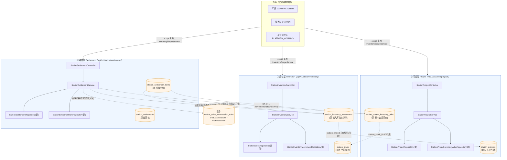
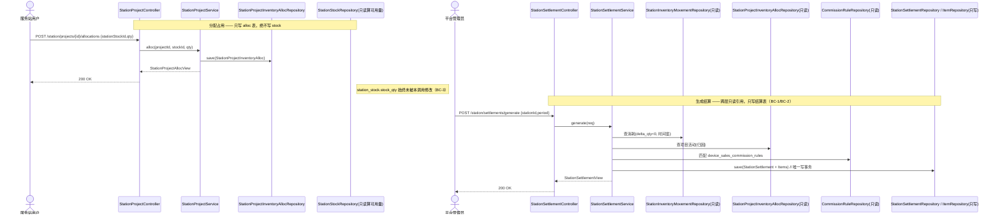

# 增量设计 · 模块四 · 服务站功能（库存 / 项目 / 结算三层解耦）

> 作者：高见远（架构师）　|　适用工程：`claw-platform`（前端 React+antd5，后端 Spring Boot 21 模块化单体）
> 依赖上游：模块三 `InventoryScope` 作用域解析、`StationStock` 现货库存、`device_sales_commission_rules` 设备提成规则、`CrossBorderSettlementService`（并列不复用）。
> 硬约束：**零破坏**（既有寄售写链路 / `ProjectController` / `SettlementController` 一律不动）、**可编译**（后端 `mvn compile` JDK21、前端 `npm run build` 通过，不引入新重依赖）、**复用优先**。

---

## 0. 设计决策摘要（含 `[D-默认]`）

| # | 决策 | 类型 | 说明 |
|---|------|------|------|
| D1 | 库存层**复用** `station_stock` 表（不新建库存主表），新增 `station_inventory_movements` 作为出入库流水/审计与"消耗"数据源 | 复用+新增 | 满足"能复用 StationStock 就不加" |
| D2 | 项目层**新建** `station_projects`（挂在站下）+ `station_project_inventory_alloc`（按 ID 引用库存行、按数量占用） | 新增 | 与既有 `projects`（资产项目树）解耦，不复用其表 |
| D3 | 结算层**新建** `station_settlements` + `station_settlement_items`（服务站寄售结算单/明细） | 新增 | 与 `CrossBorderSettlementService` 并列，不复用其逻辑 |
| D4 | **分配（alloc）不扣减库存**（逻辑占用）；可用量 = 读时计算（`stockQty − Σallocated`） | `[D-默认]` | 核心解耦保证：库存写与项目写不在同一事务 |
| D5 | 三层写事务各自封闭：库存只写 `station_stock`+`movements`；项目只写 `station_projects`+`alloc`；结算只写 `settlements`+`items` | 架构铁律 | 不出现跨层 `@Transactional` |
| D6 | 跨层**唯一耦合=ID 字段**：`alloc.station_stock_id`、`settlement_items.ref_id`、`movements.station_project_id` | 架构铁律 | 松散耦合，无外键级联写 |
| D7 | 结算由**平台管理员**生成/确认（服务站仅可查自身、可发起草稿），服务站不能单边结算 | `[D-默认]` | 结算顺序：物流费 → 服务站提成 → 厂家净额 |
| D8 | 提成取 `device_sales_commission_rules`（manufacturer_id+product_id 命中，priority 取高）；无规则 → 提成 0 | `[D-默认]` | 物流费由厂家承担 |
| D9 | 货值取 `products.price`（按 `sku_code = products.code` 关联）；物流费率取 `system_config.STATION_LOGISTICS_FEE_RATE`（默认 0） | `[D-默认]` | 具体列名以既有 schema 为准 |
| D10 | 角色作用域**复用 `InventoryScopeService.resolveCurrent()`**：station→自身站；manufacturer→下属寄售站集合；admin→全平台 | 复用 | 不重复造 scope 解析 |
| D11 | 前端新增 3 页 + 1 个 `station.json` i18n 命名空间（zh/en/km）+ `api/station.js`；菜单落点新建"服务站"分组 | 新增 | 复用 `useSupplyOptions`/`EnumTag`/`fmtTime`/`ScopeBanner`/`CrudTable`/`Perm` |
| D12 | 迁移号 **V68**（当前最大 V67 之后）；仅种子 `menu:station-*` + 角色模板挂载 + `roles.grants` 回写，沿用 V67 三步法 | 新增 | 不改动任何既有表 |

---

## 1. 总体架构图（Mermaid）



> **解耦要点**：三层各自的写事务只触碰本层仓库集合；层间只有"按 ID 的虚线引用"，没有任何一条箭头是"库存写→联动项目/结算写"。

---

## 2. 数据模型

### 2.1 复用 / 不新增的表

| 表 | 用途 | 本模块用法 |
|----|------|-----------|
| `station_stock` | 服务站现货库存（既有 `StationStock`） | **库存层"当前库存"主表**，直接复用，不新建库存主表 |
| `projects` / `project_devices` / `device_authorizations` | 既有资产项目域 | **不改动、不复用其表**（模块四项目层是"站下库存项目"，语义不同，新建 `station_projects`） |
| `device_sales_commission_rules` | 设备销售提成规则（V51） | 结算层**读取**提成，不改动 |
| `products` | 商品（含 `price`） | 结算货值来源（按 `sku_code=code`） |
| `stations` / `manufacturers` | 服务站/厂家 | 外键与名称解析 |
| `system_config` | 系统可配项（V17 已存在） | 种子 `STATION_LOGISTICS_FEE_RATE`（不新建表） |

### 2.2 新增表（建表 SQL，落 V68 迁移）

```sql
-- =====================================================================
-- Claw 平台 V68 增量（模块四 · 服务站功能：库存/项目/结算三层解耦）
-- 依据：增量设计-模块四-服务站三层解耦.md
-- 范围：
--   1) station_inventory_movements   库存出入库流水（审计 + 消耗数据源）
--   2) station_projects              服务站下项目（自引用树，与 projects 解耦）
--   3) station_project_inventory_alloc 项目按 ID 占用库存（逻辑占用，不扣库存）
--   4) station_settlements           服务站寄售结算单
--   5) station_settlement_items      结算明细（按 item_type 拆分物流费/提成/厂家净额）
--   6) system_config 种子 STATION_LOGISTICS_FEE_RATE（表已存在 V17，仅补种子）
--   7) 菜单权限种子 menu:station-*（三步法，沿用 V67）
-- 全量幂等（IF NOT EXISTS / ON CONFLICT DO NOTHING）。不修改任何既有表结构。
-- =====================================================================

SET search_path = claw;

-- 1) 库存出入库流水（库存层的"消耗/活动"数据源，供结算层只读）
CREATE TABLE IF NOT EXISTS station_inventory_movements (
    id               BIGSERIAL PRIMARY KEY,
    station_id       BIGINT       NOT NULL REFERENCES stations (id),
    sku_code         VARCHAR(64)  NOT NULL,
    delta_qty        INT          NOT NULL,                 -- + 入站/盘盈；- 消耗/盘亏/回收
    reason           VARCHAR(32)  NOT NULL,                 -- INBOUND / ADJUST / CONSUME / RECOVER
    station_project_id BIGINT,                              -- 可空：归因到某站下项目（结算按项目活动拆分）
    ref_type         VARCHAR(32),                           -- 可选业务来源类型
    ref_id           BIGINT,                                -- 可选业务来源 ID
    operator_id      BIGINT,                                -- 操作人
    tenant_id        BIGINT       NOT NULL DEFAULT 1,
    created_at       TIMESTAMPTZ NOT NULL DEFAULT now()
);
CREATE INDEX IF NOT EXISTS idx_sim_station_sku ON station_inventory_movements (station_id, sku_code);
CREATE INDEX IF NOT EXISTS idx_sim_created     ON station_inventory_movements (created_at);
CREATE INDEX IF NOT EXISTS idx_sim_project     ON station_inventory_movements (station_project_id);

-- 2) 服务站下项目（自引用树；与既有 projects 解耦）
CREATE TABLE IF NOT EXISTS station_projects (
    id           BIGSERIAL PRIMARY KEY,
    station_id   BIGINT       NOT NULL REFERENCES stations (id),
    owner_user_id BIGINT      NOT NULL,
    name         VARCHAR(120) NOT NULL,
    parent_id    BIGINT,                                      -- 自引用：父项目（根=NULL）
    depth        INT          NOT NULL DEFAULT 0,
    sort_no      INT          NOT NULL DEFAULT 0,
    status       VARCHAR(16)  NOT NULL DEFAULT 'ACTIVE',      -- ACTIVE / ARCHIVED
    tenant_id    BIGINT       NOT NULL DEFAULT 1,
    created_at   TIMESTAMPTZ  NOT NULL DEFAULT now(),
    updated_at   TIMESTAMPTZ  NOT NULL DEFAULT now()
);
CREATE INDEX IF NOT EXISTS idx_sp_station     ON station_projects (station_id, status);
CREATE INDEX IF NOT EXISTS idx_sp_parent      ON station_projects (parent_id);

-- 3) 项目按 ID 占用库存（逻辑占用，不扣减 station_stock）
CREATE TABLE IF NOT EXISTS station_project_inventory_alloc (
    id                 BIGSERIAL PRIMARY KEY,
    station_project_id BIGINT NOT NULL REFERENCES station_projects (id),
    station_stock_id   BIGINT NOT NULL REFERENCES station_stock (id),  -- 仅 ID 引用库存层
    sku_code           VARCHAR(64) NOT NULL,
    allocated_qty      INT    NOT NULL DEFAULT 0,
    note               VARCHAR(255),
    tenant_id          BIGINT NOT NULL DEFAULT 1,
    created_at         TIMESTAMPTZ NOT NULL DEFAULT now(),
    updated_at         TIMESTAMPTZ NOT NULL DEFAULT now(),
    CONSTRAINT uk_sp_alloc UNIQUE (station_project_id, station_stock_id)
);
CREATE INDEX IF NOT EXISTS idx_spia_stock ON station_project_inventory_alloc (station_stock_id);

-- 4) 服务站寄售结算单
CREATE TABLE IF NOT EXISTS station_settlements (
    id               BIGSERIAL PRIMARY KEY,
    settlement_no    VARCHAR(40) NOT NULL UNIQUE,
    station_id       BIGINT      NOT NULL REFERENCES stations (id),
    period_start     TIMESTAMPTZ,
    period_end       TIMESTAMPTZ,
    status           VARCHAR(16) NOT NULL DEFAULT 'DRAFT',       -- DRAFT / CONFIRMED / PAID
    logistics_fee    NUMERIC(16,2) NOT NULL DEFAULT 0,           -- 物流费（厂家承担）
    station_commission NUMERIC(16,2) NOT NULL DEFAULT 0,        -- 服务站提成
    manufacturer_net NUMERIC(16,2) NOT NULL DEFAULT 0,          -- 厂家净额 = 货值 - 物流费 - 提成
    currency         VARCHAR(8)  NOT NULL DEFAULT 'USD',
    created_by       BIGINT,
    created_at       TIMESTAMPTZ NOT NULL DEFAULT now(),
    confirmed_at     TIMESTAMPTZ,
    paid_at          TIMESTAMPTZ
);
CREATE INDEX IF NOT EXISTS idx_ss_station ON station_settlements (station_id, status);

-- 5) 结算明细
CREATE TABLE IF NOT EXISTS station_settlement_items (
    id           BIGSERIAL PRIMARY KEY,
    settlement_id BIGINT     NOT NULL REFERENCES station_settlements (id),
    item_type    VARCHAR(24) NOT NULL,                         -- LOGISTICS / COMMISSION / RECOVERY / ADJUST
    ref_id       BIGINT,                                       -- 仅 ID 引用：movements/alloc/recovery_order
    description  VARCHAR(255),
    amount       NUMERIC(16,2) NOT NULL,
    direction    VARCHAR(8)  NOT NULL,                         -- DEBIT(厂家出) / CREDIT(服务站入)
    created_at   TIMESTAMPTZ NOT NULL DEFAULT now()
);
CREATE INDEX IF NOT EXISTS idx_ssi_settlement ON station_settlement_items (settlement_id);
```

**system_config 种子**（物流费率，默认 0，代表"厂家承担但不额外计费"，可由运营在 settings 页调整）：

```sql
INSERT INTO system_config (config_key, config_value, category, description, data_type, editable) VALUES
    ('STATION_LOGISTICS_FEE_RATE', '0', '结算', '服务站寄售结算物流费率（货值比例），由厂家承担，默认 0', 'NUMBER', true)
ON CONFLICT (config_key) DO NOTHING;
```

### 2.3 字段说明（关键列）

- `station_inventory_movements.delta_qty`：正=入站/盘盈，负=消耗/盘亏/回收。**当前库存 `station_stock.stock_qty` 由 `StationInventoryService` 同一写事务维护**（不触碰既有 `StationService.stockIn`）。
- `station_project_inventory_alloc.allocated_qty`：**逻辑占用**，不回写 `station_stock`。可用量 = `stock_qty − Σallocated（同 station_stock_id 且项目未归档）`，读时计算（见 BC-3）。
- `station_settlements`：三金额字段 = 结算层独立计算结果；`manufacturer_net = Σ货值 − logistics_fee − station_commission`。
- `station_settlement_items.ref_id`：仅存 ID（指向 `movements` / `alloc` / `recovery_orders`），结算层不反向写这些表。

---

## 3. 后端设计

### 3.1 scope 解析复用（核心：不重复造轮子）

三层都复用既有 `InventoryScopeService.resolveCurrent(overrideManufacturerId, overrideStationId)`（模块三），得到 `InventoryScope.ScopeInfo`：
- `platformAdmin=true` → 不加 station 过滤（全平台）；
- `scopeLevel=STATION` → 允许站 = `[effectiveStationId]`；
- `scopeLevel=MANUFACTURER` → 允许站 = `subordinateStationIds`（"我的货寄在哪些站"）；
- 其它 → 空集（无数据，返回空，不抛 403，前端显示引导）。

新增一个**极薄**封装 `StationScopeService`（位于 `domain/station/`，依赖 `InventoryScopeService`），暴露 `List<Long> allowedStationIds(Long overrideStationId)`，统一三层取数口径；越权覆盖仍由 `InventoryScopeService.assertOverrideAllowed` 抛 `40301`（HTTP 403）。

### 3.2 新增 Repository / Service / DTO / Controller 清单

| 层 | 新增文件 | 职责 | 复用的既有 |
|----|---------|------|-----------|
| 库存 | `StationInventoryMovementRepository` | movements CRUD + 按站/时间窗查消耗 | `StationStockRepository`（读/写 stock） |
| 库存 | `StationInventoryService` | 当前库存列表、入站、调整、流水查询；维护 `stock_qty` 与 `movements` | `InventoryScopeService` |
| 库存 | `StationInventoryController` | `/api/v1/station/inventory` | `ApiResult`/`AuthContext`/`RequirePermission` |
| 项目 | `StationProjectRepository` | 站下项目树 | — |
| 项目 | `StationProjectInventoryAllocRepository` | 占用 CRUD | `StationStockRepository`（仅读 stock 算可用量） |
| 项目 | `StationProjectService` | 项目 CRUD 树 + 分配/解除占用 | `InventoryScopeService` |
| 项目 | `StationProjectController` | `/api/v1/station/projects` | — |
| 结算 | `StationSettlementRepository` | 结算单 CRUD | — |
| 结算 | `StationSettlementItemRepository` | 明细 CRUD | — |
| 结算 | `StationSettlementService` | 生成草稿（读 movements+alloc+commission 规则）、确认、支付 | `InventoryScopeService`、`device_sales_commission_rules`（只读）、`products`（只读价格） |
| 结算 | `StationSettlementController` | `/api/v1/station/settlements` | — |
| 共用 | `StationScopeService` | 允许站集合解析（封装 InventoryScope） | `InventoryScopeService` |
| DTO | 既有 `StationViews.java` / `StationRequests.java` **追加** record | 各层出入参 | 不新建 DTO 文件，沿用 common 层约定 |
| 迁移 | `V68__station_module_three_layer.sql` | 建表 + 种子 | 沿用 V67 三步法 |

> 注：DTO 追加到既有 `StationViews`/`StationRequests`（common 层，不 import domain），符合既有 `ProjectDtos`/`SettlementViews` 风格；**不新建 DTO 类文件**。

### 3.3 端点路径表

**`StationInventoryController`** `@RequestMapping("/api/v1/station/inventory")`

| 方法 | 路径 | 权限（`RequirePermission`） | 说明 |
|------|------|------------------------------|------|
| GET | `/` | `station:inventory:view`,`mfg:inventory:consignment:view` | 当前库存列表（按 allowedStationIds 过滤），支持 `stationId`/`skuCode` |
| GET | `/movements` | 同上 | 出入库流水（消耗数据源） |
| GET | `/me` | 同上 | 作用域视图（复用 `InventoryScope`，返回 allowedStationIds + 引导） |
| POST | `/inbound` | `station:inventory:inbound` | 服务站入站收货（+delta，写 stock+movements） |
| POST | `/adjust` | `station:inventory:adjust` | 服务站盘点调整（±delta，写 stock+movements） |

**`StationProjectController`** `@RequestMapping("/api/v1/station/projects")`

| 方法 | 路径 | 权限 | 说明 |
|------|------|------|------|
| GET | `/` | `station:project:view`,`mfg:station:project:view` | 站下项目树（按 allowedStationIds） |
| POST | `/` | `station:project:manage` | 新建项目（可挂 parentId） |
| PUT | `/{id}` | `station:project:manage` | 改名/改父/状态 |
| DELETE | `/{id}` | `station:project:manage` | 删除（子项目上提一级，解绑 alloc） |
| GET | `/{id}/allocations` | view | 项目占用列表 |
| POST | `/{id}/allocations` | `station:project:alloc` | 占用库存（body: `stationStockId`,`qty`）— **只写 alloc 表** |
| DELETE | `/allocations/{allocId}` | `station:project:alloc` | 解除占用 |

**`StationSettlementController`** `@RequestMapping("/api/v1/station/settlements")`

| 方法 | 路径 | 权限 | 说明 |
|------|------|------|------|
| GET | `/` | `station:settlement:view`,`mfg:station:settlement:view` | 结算单列表（按 allowedStationIds） |
| GET | `/{id}` | view | 结算单 + 明细 |
| POST | `/generate` | `station:settlement:manage` | 按 `(stationId, periodStart, periodEnd)` 生成草稿（读 movements+alloc+rules，写 settlements+items） |
| POST | `/{id}/confirm` | `station:settlement:manage` | 确认（DRAFT→CONFIRMED） |
| POST | `/{id}/pay` | `station:settlement:manage` | 标记支付（CONFIRMED→PAID） |

> 既有 `ProjectController`（`/api/v1/projects`）、`SettlementController`（`/api/v1/settlements/cross-border`）、`StationService`、`InventoryService` **零改动**。

---

## 4. 前端设计

### 4.1 新增页面（落 `web/src/pages/`）

| 页面 | 文件 | 内容 | 复用组件 |
|------|------|------|---------|
| 库存层 | `StationInventory.jsx` | 当前库存表格（列工厂复用 `useInventoryColumns` `'station'` 变体或自建精简列）+ 入站/调整按钮（`<Perm>` 门控）+ 流水抽屉 | `PageCard`/`Table`/`Perm`/`useSupplyOptions`/`EnumTag`/`fmtTime`/`ScopeBanner` |
| 项目层 | `StationProjects.jsx` | 左：站下项目树（`Tree`）；右：项目信息 + 占用库存表（挂载/解除）+ 可用量展示 | `PageCard`/`Tree`/`Table`/`Perm`/`useSupplyOptions` |
| 结算层 | `StationSettlement.jsx` | 结算单列表 + 生成草稿表单（选站/周期）+ 明细抽屉（物流费/提成/厂家净额三行） | `PageCard`/`Table`/`Perm`/`useSupplyOptions` |

### 4.2 复用组件（不新建通用组件）

- 下拉/名称解析：`useSupplyOptions()`（厂家/站/商品）；
- 枚举 Tag：`EnumTag`；时间：`fmtTime`；空值：`EMPTY`；
- 作用域提示条：`ScopeBanner`（库存层顶部展示 allowedStationIds）；
- 权限门：`<Perm>` / `<RequirePermRoute>`；
- 表格：`Table`（复杂交互页沿用 `StationConsignment.jsx`/`ProjectManagement.jsx` 手写模式，不强行套 `CrudTable`，因涉及树/占用/明细）。

### 4.3 菜单落点与 i18n key

- **菜单**：在 `nav.js` 的 `NAV` 中新增顶级分组
  ```js
  { key: 'station', label: 'nav:group.station', icon: ShopOutlined, children: [
    { key: 'station-inventory',  label: 'nav:item.station-inventory',  path: '/station-inventory' },
    { key: 'station-projects',   label: 'nav:item.station-projects',   path: '/station-projects' },
    { key: 'station-settlements',label: 'nav:item.station-settlements',path: '/station-settlements' },
  ]}
  ```
  并在 `ROUTES` 追加三路径；`ShopOutlined` 已在 `ICON_REGISTRY`。
- **i18n（三语 zh/en/km）**：
  - `nav.json`：新增 `group.station` + `item.station-inventory/projects/settlements`；
  - **新建 `station.json` 命名空间**（`web/src/i18n/locales/{zh,en,km}/station.json`），存放三页文案（标题/列/按钮/提示），并在 i18n 入口 `index` 注册；页面用 `useTranslation(['common','station'])`。
  - 关键 key 示例：`station:inventory.title`、`station:inventory.inbound`、`station:project.title`、`station:project.alloc`、`station:project.available`、`station:settlement.title`、`station:settlement.generate`、`station:settlement.logisticsFee`/`stationCommission`/`manufacturerNet`。

### 4.4 API 封装

新增 `web/src/api/station.js`（导出后在 `index.js` 聚合）：
```js
import api from '../api.js';
import { cleanParams } from './supplyChain.js';

export const listStationInventory = (p) => api.get('/v1/station/inventory', { params: cleanParams(p) });
export const listStationMovements = (p) => api.get('/v1/station/inventory/movements', { params: cleanParams(p) });
export const inboundStationInventory = (b) => api.post('/v1/station/inventory/inbound', b);
export const adjustStationInventory = (b) => api.post('/v1/station/inventory/adjust', b);

export const listStationProjects = (p) => api.get('/v1/station/projects', { params: cleanParams(p) });
export const createStationProject = (b) => api.post('/v1/station/projects', b);
export const updateStationProject = (id, b) => api.put(`/v1/station/projects/${id}`, b);
export const deleteStationProject = (id) => api.delete(`/v1/station/projects/${id}`);
export const listStationProjectAllocs = (id) => api.get(`/v1/station/projects/${id}/allocations`);
export const allocStationInventory = (id, b) => api.post(`/v1/station/projects/${id}/allocations`, b);
export const deallocStationInventory = (allocId) => api.delete(`/v1/station/projects/allocations/${allocId}`);

export const listStationSettlements = (p) => api.get('/v1/station/settlements', { params: cleanParams(p) });
export const getStationSettlement = (id) => api.get(`/v1/station/settlements/${id}`);
export const generateStationSettlement = (b) => api.post('/v1/station/settlements/generate', b);
export const confirmStationSettlement = (id) => api.post(`/v1/station/settlements/${id}/confirm`);
export const payStationSettlement = (id) => api.post(`/v1/station/settlements/${id}/pay`);
```

---

## 5. 权限矩阵

| 资源 | 服务站 STATION | 厂家 MANUFACTURER | 平台管理员 PLATFORM_ADMIN |
|------|----------------|-------------------|---------------------------|
| 库存层（自身在库） | 查看自身 `station:inventory:view`；入站 `station:inventory:inbound`；调整 `station:inventory:adjust` | 查看寄售在站 `mfg:inventory:consignment:view` | `*` 全看全做 |
| 项目层（站下项目） | 管理自身 `station:project:manage`；占用 `station:project:alloc`；查看 `station:project:view` | 查看下属站项目 `mfg:station:project:view` | `*` |
| 结算层（寄售结算） | 查看自身 `station:settlement:view`；可发起草稿 | 查看下属站 `mfg:station:settlement:view` | 生成/确认/支付 `station:settlement:manage`（`*`） |

> 上级看下级：服务站看下属站（既有权限模型）；厂家看"货寄在哪些站"（复用 `InventoryScope.subordinateStationIds`）；管理员全看。越权覆盖（如服务站传他人 stationId）由 `InventoryScopeService.assertOverrideAllowed` 抛 403。

---

## 6. 三层解耦如何被代码保证（边界检查点 · 供 QA 验收）

| 检查点 | 保证内容 | 验证方式 |
|--------|---------|---------|
| **BC-1 写事务边界** | 三个 `@Transactional` 服务各自只触碰本层仓库：`StationInventoryService`→`StationStockRepository`+`StationInventoryMovementRepository`；`StationProjectService`→`StationProjectRepository`+`StationProjectInventoryAllocRepository`；`StationSettlementService`→`StationSettlementRepository`+`StationSettlementItemRepository`。**不存在跨两层的一个事务**。 | 代码审查：每个 service 的 `@Transactional` 方法体内不出现另一层的 repository 写入 |
| **BC-2 仅 ID 引用** | 跨层引用只有 ID 字段：`alloc.station_stock_id`、`settlement_items.ref_id`、`movements.station_project_id`。无跨层外键级联 UPDATE/DELETE。 | 查表结构 + 代码：结算/项目写操作不 `save()` 对方实体 |
| **BC-3 分配不扣库存** | `allocStationInventory` 只 `save` 到 `station_project_inventory_alloc`；`station_stock.stock_qty` 不变。可用量 = 读时 `stock_qty − Σalloc.allocated_qty`。 | 单测：分配后 `station_stock` 行 `stock_qty` 不变；可用量接口正确下降 |
| **BC-4 独立可查** | 三个列表 GET 各自解析 scope、互不 JOIN 对方基表；任一层的查询失败不影响其它层。 | 集成测试：屏蔽 project/settlement 数据时，inventory 列表仍正常返回 |
| **BC-5 角色可见性** | 每层都经 `StationScopeService.allowedStationIds()` 过滤；station=自身、mfg=下属站、admin=全；越权抛 403。 | 权限测试：服务站 A 用户查 stationId=B 的库存/项目/结算 → 403 |
| **BC-6 零破坏** | 既有 `ProjectController`/`SettlementController`/`StationService`/`InventoryService` 文件未改动（git diff 为空）。 | `git diff --stat` 确认仅新增文件 + DTO record 追加 + 前端新增页/路由/i18n |

> **一句话验收口径**："改库存绝不会连带写项目/结算；改项目占用绝不会动库存；三层任何一层都能被对应角色单独查到，且跨层只通过 ID 关联。"

---

## 7. 任务清单（有序 · 含依赖 · 按实现顺序）

> 类型标记：🔧后端　🎨前端　🗄迁移　🧪测试

| 序 | 任务 ID | 任务 | 类型 | 依赖 | 交付物 |
|----|---------|------|------|------|--------|
| 1 | T-INFRA | **基础设施与迁移 V68**：建 5 张新表 + `system_config` 种子 + `menu:station-*` 权限种子（三步法沿用 V67）+ `roles.grants` 回写（MANUFACTURER/STATION，避开 PLATFORM_ADMIN 通配与 CUSTOMER 对象结构） | 🗄迁移 | — | `V68__station_module_three_layer.sql`（可 `mvn compile` + Flyway 通过） |
| 2 | T-DTO | **通用 DTO/复用 scope**：在 `StationViews.java`/`StationRequests.java` 追加各层 record；新增 `StationScopeService`（封装 `InventoryScopeService.allowedStationIds`） | 🔧后端 | T-INFRA | DTO + `StationScopeService`（编译通过） |
| 3 | T-INV | **库存层**：`StationInventoryMovementRepository` + `StationInventoryService`（列表/入站/调整/流水，维护 stock_qty 与 movements，不动 `StationService`）+ `StationInventoryController`（`/api/v1/station/inventory`） | 🔧后端 | T-DTO | 库存层端点（编译+单测） |
| 4 | T-PRJ | **项目层**：`StationProjectRepository` + `StationProjectInventoryAllocRepository` + `StationProjectService`（树 CRUD + 分配/解除，仅写 alloc）+ `StationProjectController`（`/api/v1/station/projects`） | 🔧后端 | T-DTO | 项目层端点（编译+单测） |
| 5 | T-SET | **结算层**：`StationSettlementRepository` + `StationSettlementItemRepository` + `StationSettlementService`（generate 读 movements+alloc+`device_sales_commission_rules`+`products.price` 算三金额，只写 settlements+items）+ `StationSettlementController`（`/api/v1/station/settlements`） | 🔧后端 | T-DTO | 结算层端点（编译+单测） |
| 6 | T-API-FE | **前端 API + 路由 + 菜单 + i18n**：`api/station.js`、注册 `nav.js`（服务站分组+三路径+ROUTES）、`App.jsx` 三路由、三语 `nav.json` + 新建 `station.json` 命名空间 | 🎨前端 | T-INFRA | 前端可编译（`npm run build`），菜单可见受权限控制 |
| 7 | T-PAGE-INV | **前端库存页** `StationInventory.jsx`（复用 `PageCard`/`Table`/`Perm`/`useSupplyOptions`/`EnumTag`/`ScopeBanner`），入站/调整按钮门控 | 🎨前端 | T-API-FE,T-INV | 库存页可用 |
| 8 | T-PAGE-PRJ | **前端项目页** `StationProjects.jsx`（项目树 + 占用库存表 + 可用量读时计算展示） | 🎨前端 | T-API-FE,T-PRJ | 项目页可用 |
| 9 | T-PAGE-SET | **前端结算页** `StationSettlement.jsx`（列表 + 生成草稿表单 + 明细抽屉三金额） | 🎨前端 | T-API-FE,T-SET | 结算页可用 |
| 10 | T-QA | **解耦验收与回归**：按 §6 六检查点写集成测试（BC-1~BC-6）；确认既有寄售/项目/结算链路 git diff 为空；后端 `mvn compile`、前端 `npm run build` 通过 | 🧪测试 | T-INV,T-PRJ,T-SET,T-PAGE-INV,T-PAGE-PRJ,T-PAGE-SET | 验收报告 + 解耦断言全绿 |

**实现顺序建议**：T-INFRA → T-DTO → (T-INV ∥ T-PRJ ∥ T-SET) → T-API-FE → (T-PAGE-INV ∥ T-PAGE-PRJ ∥ T-PAGE-SET) → T-QA。三层后端可并行（互不依赖），三页前端可并行（均依赖 T-API-FE）。

---

## 8. 开放问题 → `[D-默认]` 决策记录

用户已明确"跳过逐项提问，采用架构师推荐默认"，以下一律标 `[D-默认]`，不再反问：

1. **[D-默认] 库存层是否新建主表？** 否，复用 `station_stock`；仅新增流水表 `station_inventory_movements`（D1）。
2. **[D-默认] 占用是否扣库存？** 否，逻辑占用，可用量读时计算（D4/BC-3）。
3. **[D-默认] 谁触发结算？** 平台管理员生成/确认；服务站仅查自身、可发起草稿（D7）。
4. **[D-默认] 提成/物流/货值来源？** 提成=`device_sales_commission_rules`；货值=`products.price`（sku_code=code）；物流费=`system_config.STATION_LOGISTICS_FEE_RATE`×货值，厂家承担（D8/D9）。
5. **[D-默认] 既有 `projects` 表能否复用？** 不复用；新建 `station_projects`（语义是"站下库存项目"，与资产项目树正交）（D2）。
6. **[D-默认] scope 是否重做？** 否，复用 `InventoryScopeService.resolveCurrent()` + 薄封装 `StationScopeService`（D10）。
7. **[D-默认] 菜单落点？** 新建"服务站"顶级分组，三页并列（D11）。
8. **[D-默认] 迁移号？** V68（当前最大 V67）（D12）。

---

## 9. 关键调用时序（Mermaid · 演示"分配不扣库存"与"结算只读跨层"）



---

### 附：编译/构建自检清单（交付前工程师自测）

- [ ] 后端 `mvn -q -DskipTests compile`（JDK21）通过，无新增重依赖；
- [ ] 前端 `npm run build` 通过，`station.json` 三语已注册，路由/菜单已加；
- [ ] `git diff` 确认 `ProjectController`/`SettlementController`/`StationService`/`InventoryService` 及既有表结构**零改动**；
- [ ] 三层各自列表接口在越权传参下返回 403，正常传参返回自身/下属/全部（按角色）。
